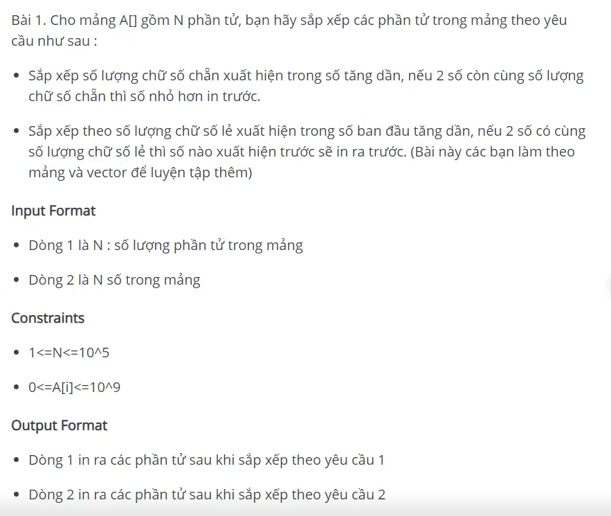

# Cấu trúc dữ diệu và giải thuật

**Ngày bắt đầu: 04/07/2025**

**Ngày kết thúc: 04/09/2025**

> Khóa học này của **28Tech** 2024. Mình mong rằng khóa học này sẽ giúp mình hiểu rõ các thuật toán, cấu trúc dữ liệu, …
> 

## **Link học:** [28Tech DSA 2024](https://hoctaponline.org/course/course-watch/364)

# Nội dung bài học

## Lý thuyết số & tổ hợp

### Sàng số nguyên tố

Sàng số nguyên tố là một thuật toán giúp bạn có thể kiểm tra nhanh các số nguyên tố trong đoạn từ 1 tới N hoặc trong khoảng giữa 2 số. Bài viết này mình sẽ hướng dẫn bạn một thuật toán rất hiệu quả trong lý thuyết số. Đây là một kiến thức cơ bản mà bạn cần nắm được khi làm việc với số nguyên tố.

**1. Sàng Số Nguyên Tố**

**Bài toán** : Liệt kê (đếm) các số nguyên tố trong khoảng từ 1 đến N ( N ≤ 107) .

Cách làm thông thường của bài toán này là sử dụng hàm kiểm tra số nguyên tố có độ phức tạp O(√N) sau đó duyệt vòng lặp từ 1 tới N và kiểm tra. Độ phức tạp của phương pháp này sẽ là O(N√N)

Sàng số nguyên tố Eratosthenes là một thuật toán hiệu quả hơn, thuật toán được phát minh bởi nhà toán học người Hy Lạp. Độ phức tạp của thuật toán sàng số nguyên tố là O(NloglogN)

Ý tưởng của thuật toán đó là sử dụng mảng đánh dấu để có thể kiểm tra nhanh một số có phải là số nguyên tố hay không sau khi sàng. Nếu bạn chưa biết kỹ thuật mảng đánh dấu có thể tham khảo [tại đây](https://blog.28tech.com.vn/c-mang-danh-dau)

**Thuật toán :**

1. Coi tất cả các số nguyên từ 0 tới N đều là số nguyên tố
2. Sàng : Bước này sẽ loại bỏ các số nguyên không phải là số nguyên tố nếu nó là bội của một số nguyên tố khác

Sàng số nguyên tố cần 1 mảng đánh dấu đủ lớn, tối thiểu thì chỉ số của mảng đánh dấu này phải lớn hơn hoặc bằng N. Ví dụ nếu bạn sàng tới N = 1000 thì mảng đánh dấu ít nhất cần 1001 phần tử.

Vì thế bạn cũng sẽ thấy thuật toán này sẽ không thể sàng nếu N quá lớn vì bạn không thể khai báo mảng đánh dấu quá lớn, việc này sẽ làm tràn bộ nhớ cho phép (thông thường là 256MB trên các Online Judge).

Thuật toán này khá đơn giản, nó chỉ đơn thuần duyệt các số nguyên từ 2 tới √N và nếu số duyệt qua là số nguyên tố thì ta có thể loại bỏ các bội của số này

Ví dụ với N = 30 thì bạn cần duyệt từ 2 tới √30 = 5. Các số nguyên tố trong đoạn từ 2 tới 5 sẽ giúp bạn loại bỏ được các hợp số từ 2 tới 30.


Số nguyên tố 2 thì loại bỏ các số : 4, 6, 8, 10, 12...30

Số nguyên tố 3 thì loại bỏ các số : 9, 12, 15, 18, 21,...30

Số nguyên tố 5 thì loại bỏ các số : 25, 30

**Mã nguồn :**

```cpp
#include <iostream>
#include <math.h>
using namespace std;

int prime[10000001]; // N = 10^7

void sang(){
        //Bước 1 : Coi tất cả các số từ 0 tới N là số nguyên tố
	for(int i = 0; i <= 10000000; i++){
		prime[i] = 1;
	}
        //Bước 2 : Sàng
	prime[0] = prime[1] = 0;
	for(int i = 2; i <= sqrt(10000000); i++){
		if(prime[i]){
			for(int j = i * i; j <= 10000000; j += i){
				prime[j] = 0;
			}
		}
	}
}

int main(){
	sang();
	for(int i = 0; i <= 30; i++){
		if(prime[i]){
			cout << i << " ";
		}
	}
	return 0;
}
```

Output :

```cpp
2 3 5 7 11 13 17 19 23 29
```

**Giải thích mã nguồn :**

Trong mã nguồn trên có một vài điểm bạn cần chú ý :

- Mảng prime[] có thể là mảng int, bool, char tùy bạn và tùy ngôn ngữ lập trình bạn sử dụng
- Kích cỡ mảng prime[] là bao nhiêu ? Như mình đã nói ở trên thì tối thiểu nó cần là N + 1 vì ta cần sử dụng tới chỉ số N của mảng này.
- Vì sao lại duyệt từ 2 tới √N ? Ví dụ N = a * b thì bạn sẽ thấy nếu cả a và b đều lớn hơn √N thì điều này là không thể, chắc chắn sẽ có ít nhất a hoặc b ≤ √N. Vậy thì mình biết chắc chắn sẽ có 1 ước nguyên tố của N (nếu có) sẽ nằm trong đoạn từ 2 tới √N thì ta chỉ cần tìm số này thay vì quan tâm tới số còn lại. Ví dụ với N = 28 thì nhiều bạn thắc mắc là 28 sẽ có ước nguyên tố là 7 nằm ngoài khoảng [2, √N] nhưng rõ ràng thì nó cũng có 1 ước nguyên tố là 2 nằm trong đoạn này và 2 đã loại bỏ số 28 ra khỏi tập số nguyên tố. Vậy nên nếu N không phải là số nguyên tố thì chắc chắn nó sẽ có 1 ước nguyên tố thuộc đoạn [2, √N], ta sẽ dùng số này để loại bỏ N
- Tại sao bội của i là j lại bắt đầu từ i * i mà không phải là 2 * i ? Khi bạn đã biết i là số nguyên tố thì bạn sẽ nghĩ ngay bội số đầu tiên (khác i) là 2 * i, điều này là chính xác bạn cũng có thể cho j chạy từ 2 * i tuy nhiên để ý kỹ bạn sẽ thấy những bội số của i mà nhỏ hơn i * i đã bị loại rồi. Ví dụ khi bạn xét i = 5 thì bội đầu tiên của i sẽ là 10 nhưng số này bị loại bởi 2, bội tiếp theo là 15, 20 cũng bị loại bởi 2, 3. Vậy rõ ràng là các bội của i mà nhỏ hơn i * i sẽ bị loại bởi các số nguyên tố nhỏ hơn i nên bạn không cần loại nữa.
- Bước nhảy của vòng lặp khi xét bội của i sẽ là i, khi đó vòng lặp chỉ duyệt qua các bội của i mà thôi.

---

**2. Sàng Số Nguyên Tố Trên Đoạn**

Trong trường hợp bạn muốn sàng số nguyên tố trong đoạn giữa 2 số L, R thì yêu cầu bạn cũng cần xây dựng được mảng đánh dấu có cỡ R - L + 1.

Khi đó để đánh dấu giá trị các số từ L tới R thì bạn đánh dấu các chỉ số từ 0 tới R - L

Ví dụ L = 10, R = 41 thì bạn sẽ đánh dấu các chỉ số tương ứng là 0 tới 31

Thuật toán sàng số nguyên tố trong đoạn tương tự như thuật toán sàng số nguyên tố từ 1 tới N

**Mã nguồn :**

```cpp
#include <iostream>
#include <math.h>
using namespace std;

typedef long long ll;

void sang(ll L, ll  R){
	int prime[R - L + 1];
	for(ll i = L; i <= R; i++){
		prime[i - L] = 1;
	}
	for(ll i = 2; i <= sqrt(R); i++){
		for(ll j = max(i * i, (L + i - 1) / i * i); j <= R; j += i){
			prime[j - L] = 0;
		}
	}
	for(ll i = max(2ll, L); i <= R; i++){
		if(prime[i - L]){
			cout << i << ' ';
		}
	}
}

int main(){
	sang(10, 41);
}
```

Output :

```cpp
11 13 17 19 23 29 31 37 41
```

**Giải thích mã nguồn :**

- Vì sao không dùng mảng cỡ R + 1 ? Ở đây L và R có thể rất lớn (lên tới long long) và bạn chỉ sàng được khi L và R của bạn không cách nhau quá xa nên không thể dùng mảng cỡ R mà cần dùng mảng cỡ R - L + 1. Ví dụ L = 1000000000 và R = 1000800000 thì bạn chỉ cần dùng mảng cỡ R - L + 1 = 800001 thay vì cỡ 1000800000 ( điều này là không thể)
- Vì sao lại duyệt bội đầu tiên của i là max(i * i, (L + i - 1) / i * i), giá trị (L + i - 1) / i * i là gì ? (L + i - 1) / i * i là bội nhỏ nhất của L ≥ i * i, công thức này dựa trên phép chia nguyên trong lập trình, bạn có thể nháp ra để hiểu rõ hơn. Khi duyệt bội của i ta không nên duyệt từ i * i ví dụ i = 2 và L = 1000000000 thì thay vì phải duyệt từ 4 bạn nên duyệt từ 1000000000, thông thường bạn sẽ duyệt từ i * i nhưng trong trường hợp này có thể tìm max của i * i với số nhỏ nhất ≥ L mà chia hết cho i để giảm số vòng lặp không cần thiết
- Vì sao khi duyệt để in kết quả không duyệt từ L mà duyệt từ max(2, L) ? Vì khi duyệt bội của các số nguyên tố thì bạn duyệt từ i = 2 nên không thể xét được các số 0, 1 không phải là số nguyên tố, ví dụ L = 0, 1 thì bạn sẽ in ra 0, 1 là số nguyên tố. Để tránh việc này thì bạn sẽ duyệt từ max(2, L)

### Lý thuyết đồng dư

**1. Lý Thuyết Đồng Dư**

Trong lập trình có những bài toán có kết quả rất lớn và tăng nhanh trong quá trình tính toán, ví dụ như giai thừa, số Fibonacci, Lũy thừa.

Tốc độ của ngôn ngữ C/C++ hoàn toàn có thể tính được 1000000 giai thừa trong chưa tới một giây, tuy nhiên việc lưu trữ kết quả của bài toán lại rất khó khăn vì C/C++ không hỗ trợ xử lý số nguyên lớn. Ngay cả bạn sử dụng Python hay Java để xử lý số nguyên lớn thì việc phải tính toán các giá trị này sẽ rất mất thời gian do phải xử lý các số rất lớn.

Cách dễ dàng hơn là chia dư kết quả cho một số định trước

**Công Thức Đồng Dư :**

- (A + B) % C = ((A % C) + (B % C)) % C
- (A - B) % C = ((A % C) - (B % C)) % C
- (A * B) % C = ((A % C) * (B % C)) % C
- (A / B) % C = ((A % C) * (B^(-1) % C)) % C

4 công thức trên bạn có thể áp dụng cho 2 số hoặc N số đều được, trong đó 3 công thức đầu dễ hiểu và có thể thực hành ngay, công thức thứ 4 liên quan tới Nghịch đảo mô đun nên các bạn có thể chuyển tới mục này ở bài học bên dưới để đọc trước.

Ví dụ (13 + 19) % 5 = ((13 % 5) + (19 % 5)) % 5 = (3 + 4) % 5 = 2

Lý do cần dùng công thức đồng dư là vế trái của 4 công thức trên không phải lúc nào cũng có thể tính được, nó có thể tràn giới hạn của số long long trong C/C++

**Ví dụ** : Tính ab chia dư cho 10, (1 ≤ a, b ≤106)

Code sai :

```cpp
#include <iostream>
#include <math.h>
using namespace std;

#define ll long long
int powMod(int a, int b){
	ll res = 1;
	for(int i = 1; i <= b; i++){
		res *= a;
	}
	return res % 10;
}

int main(){
	cout << powMod(2, 10) << endl; // 1024
	cout << powMod(2, 30) << endl; // 1073741824
	cout << powMod(2, 61) << endl; // 2305843009213693952
	cout << powMod(2, 1000000) << endl;
	return 0;
}
```

Output :

```cpp
4
4
2
0
```

Mã nguồn trên thì hàm powMod chỉ cho kết quả đúng nếu giá trị của biến res khi tính lũy thừa không bị tràn giới hạn của số long long.

Nếu tính 21000000 thì kết quả bị sai, vì tận cùng của là số 21000000 là 6. Lũy thừa cơ số 2 sẽ tận cùng với chu kỳ 4 lần lượt là 2, 4, 8, 6 tương ứng với khi số mũ chia cho 4 dư 1, 2, 3, 0

Việc tính ab rồi đem kết quả chia cho 10 tương tự như bạn áp dụng công thức thứ 3 trong phần lý thuyết với b số a nhân vào nhau.

Code đúng :

```cpp
#include <iostream>
#include <math.h>
using namespace std;

#define ll long long
int powMod(int a, int b){
	ll res = 1;
	for(int i = 1; i <= b; i++){
		res *= (a % 10);
		res %= 10; //quan trong
	}
	return res;
}

int main(){
	cout << powMod(2, 10) << endl; // 1024
	cout << powMod(2, 30) << endl; // 1073741824
	cout << powMod(2, 61) << endl; // 2305843009213693952
	cout << powMod(2, 1000000) << endl;
	return 0;
}
```

Output :

```cpp
4
4
2
6
```

**Nhận xét :**

Để hàm powMod hoạt động đúng bạn cần bổ sung thêm 2 phần :

- Thay vì nhân a vào kết quả thì chỉ cần nhân (a % 10), phần này là dựa theo lý thuyết
- Chia dư kết quả cho 10 sau mỗi lần nhân, phần này là rất quan trọng vì trong quá trình nhân thì biến res có thể bị tràn dữ liệu long long dẫn tới kết quả sai.

Ở đây chắc bạn sẽ thắc mắc về phần thứ 2 khi ta phải chia dư kết quả cho 10 sau mỗi lần nhân vì nó không có giống trong mục lý thuyết cung cấp. Trong mục lý thuyết khi phát triển công thức thứ 3 cho N số thì đáng lẽ ta phải nhân N số dư của các số này với nhau thôi chứ không được chia dư trong quá trình nhân phải không?

Ví dụ (13 * 11 * 8 * 7) % 5 thì nếu chỉ nhân các số dư với nhau và cuối cùng mới đem chia dư cho 5 thì kết quả sẽ là (3 * 11 * 3 * 2) % 5 = 198 % 5 = 3.

Giả sử bạn nhân 3 số đầu với nhau rồi thay vì giữ nguyên thì đem chia cho 5 ta sẽ có kết quả là (99 *  2) % 5 = ((99 % 5) * 2) % 5 = 8 % 5 = 3, rõ ràng là việc chia dư kết quả trong quá trình tính toán không ảnh hưởng gì tới kết quả cuối cùng.

Hoặc bạn có thể coi cụm (13 * 11 * 8) là A, 7 là B và 5 là C trong công thức thứ 3 thì rõ ràng là là bạn chỉ cần tính số dư của A sau đó nhân với số dư của B là được. Ngoài ra cụm A cũng có thể chia nhỏ thành (13 *  11) và 8, tiếp tục chia nhỏ ra thì bạn thấy việc chia dư trong quá trình tính toán là hoàn toàn đúng đắn.

## BÀI TẬP C++&STL, THUẬT TOÁN

### C++ & STL

### Vector, pair, iterator, comparator

### **[Vector] Bài 2: Erase Insert**

Cho vecto và 2 thao tác

- Thao tác 1: Chèn phần tử vào vị trí bất kì trong vector.
- Thao tác 2: Xóa phần tử ở vị trí bất kì trong vector.
- Đối với thao tác 1, giả sử vector đang có N phần tử, chỉ số chèn hợp lệ sẽ là từ 0 tới N, ngoài ra các vị trí không hợp lệ sẽ không thực hiện chèn. Tương tự đối với thao tác 2, giả sử vector đang có N phần tử thì chỉ số xóa hợp lệ sẽ là từ 0 đến N - 1, nếu vị trí xóa không hợp lệ vector sẽ không thực hiện xóa.

Nhiệm vụ của bạn là thực hiện 1 loạt các thao tác này và in ra mảng sau khi thực hiện xong mọi thao tác. Nếu vector rỗng in ra EMPTY, ngược lại ỉn ra các phần tử trong vector trên 1 dòng.

**Input Format**

- Dòng 1 là M: số lượng phần tử trong vector.
- Dòng 2 là M số trong vector.
- Dòng 3 là N số thao tác thực hiện. N dòng tiếp theo mỗi dòng mô tả thao tác, nếu thao tác là 1 sẽ có thêm 1 phần tử được thêm vào cuối.

**Output Format**

In ra EMPTY nếu vector rỗng, ngược lại in ra các phần tử trong vector trên 1 dòng

**Sample Input**

```cpp
5
40 87 73 47 22
5
1 3 21
2 3
2 0
2 1
1 0 70
```

**Sample Output**

```cpp
70 87 47 22
```

**Cách giải**

```cpp
#include <iostream>
#include <vector>

using namespace std;

int main(){
    int n;
    vector<int> v;
    cin >> n;
    for(int i = 0; i < n; i++)
    {
        int x; cin >> x;
        v.push_back(x);
    }

    int number;
    cin >> number;
    for(int j = 0; j < number; j++)
    {
        int tt, pos, val; cin >> tt;
        if(tt == 1){
            cin >> pos >> val;
            v.insert(v.begin() + pos, val);
        } else if(tt == 2) {
            cin >> pos;
            v.erase(v.begin() + pos);
        }
    }

    if(v.size() == 0)
    {
        cout << "ẸMPTY";
    } else {
        for(auto x : v)
        {
            cout << x << " ";
        }
    }

    return 0;
}
```

### **[Vector] Bài 3: Sắp xếp**

Cho vector V có N phần tử, hãy sắp xếp các phần tử tong vector theo thứ tựt tăng dần, giảm dần sau đó in ra bằng iterator

Để sắp xếp vector hãy dùng hàm sort trong thư viện

```cpp
#include <algorithm>
// Tăng dần
sort(v.begin(), v.end());
// Giảm dần
sort(v.begin(), v.end(), greater<int>());
```

**Input Format**

- Dòng 1 là M: số lượng phần tử trong vector.
- Dòng 2 là M số trong vector.

**Output Format**

- Dòng 1 in ra vector tăng dần.
- Dòng 2 in ra vector giảm dần.

**Sample Input**

```cpp
8
90 89 77 60 23 15 12 11
```

**Sample Output**

```cpp
Vector tăng dần: 
11 12 15 23 60 77 89 90
Vector giảm dần:
90 89 77 60 23 15 12 11
```

**Cách giải**

```cpp
#include <iostream>
#include <algorithm>
#include <vector>

using namespace std;

int main(){
    int n; cin >>n;
    vector<int> v;
    for(int i = 0; i < n; i++)
    {
        int x; cin >> x;
        v.push_back(x);
    }
    // tăng dần
    sort(v.begin(), v.end());
    cout << "Vector tăng dần: " << endl;
    vector<int>::iterator it = v.begin();
    for(it = v.begin(); it != v.end(); it++)
    {
        cout << *it << " ";
    }
    cout << endl;
    // Giảm dần
    sort(v.begin(), v.end(), greater<int>());
    cout << "Vector giảm dần: " << endl;
    for(auto x : v)
    {
        cout << x << " ";
    }
    return 0;
}
```

### **[Vector] Bài 4: Duyệt**

Cho vector V có N phần tử, hãy in ra các phần tử từ chỉ số L tới chỉ số R sau đó in ra các phần tử từ chỉ số R tới L bằng iterator

**Input Format**

- Dòng 1 là M: số lượng phần tử trong vector.
- Dòng 2 là M số trong vector.
- Dòng 3 là L và R.

**Output Format**

- Dòng 1 in ra vector từ L tới R.
- Dòng 2 in ra vector từ R tới L.

**Sample Input**

```cpp
10
8 1 8 3 8 5 3 5 9 7
3 6
```

**Sample Output**

```cpp
3 8 5 3 
3 5 8 3
```

**Cách giải**

```cpp
#include <iostream>
#include <algorithm>
#include <vector>

using namespace std;

int main(){
    int n; cin >>n;
    vector<int> v;
    for(int i = 0; i < n; i++)
    {
        int x; cin >> x;
        v.push_back(x);
    }
    int a, b; cin >> a >> b;
    vector<int>:: iterator it = v.begin();
    for(it = v.begin() + a; it <= v.begin() + b; it++)
    {
        cout << *it << " ";
    }

    cout << endl;
    for(it = v.begin() + b; it >= v.begin() + a; it--)
    {
        cout << *it << " ";
    }

    return 0;
}
```

### **[Vector] Bài 5: Lật ngược vector**

Cho vector V có N phần tử, hãy lật ngược vector và in ra các phần tử. Sau khi lật ngược toàn bộ vector, hãy tiếp tục lật ngược các phần tử từ chỉ số L tới chỉ số R sau đó in ra vector. Để lật ngược vector V:

```cpp
reverse(v.begin(), v.end())
```

, để lật ngược vector từ chỉ số L đến R:

```cpp
reverse(v.begin() + L, v.begin() + R + 1)
```

**Input Format**

- Dòng 1 là M: số lượng phần tử trong vector.
- Dòng 2 là M số trong vector.
- Dòng 3 là L và R.

**Output Format**

- Dòng 1 in ra vector sau khi lật lần 1.
- Dòng 2 in ra vector sau khi lật lần 2.

**Sample Input**

```cpp
13
5 3 4 1 6 3 0 3 1 4 8 4 1
3 8
```

**Sample Output**

```cpp
1 4 8 4 1 3 0 3 6 1 4 3 5 
1 4 8 6 3 0 3 1 4 1 4 3 5
```

**Cách giải**

```cpp
#include <iostream>
#include <algorithm>
#include <vector>

using namespace std;

int main(){
    int n; cin >>n;
    vector<int> v;
    for(int i = 0; i < n; i++)
    {
        int x; cin >> x;
        v.push_back(x);
    }
    int a, b; cin >> a >> b;
    // Lật vector lần 1
    reverse(v.begin(), v.end());
    for(auto x : v)
    {
        cout << x << " ";
    }
    // Lật vector lần 2
    cout << endl;
    reverse(v.begin() + a, v.begin() + b + 1);
    for(auto x : v)
    {
        cout << x << " ";
    }

    return 0;
}
```

### **[Vector] Bài 6: max_element, min_element, accumulate**

Cho vector V có N phần tử, hãy dùng hàm max_element để tìm phần tử lớn nhất, min_element để tìm phần tử bé nhất, accumulate để tính tổng. Cú pháp (đối với mảng dùng (a, a + n)):

```cpp
*max_element(v.begin(), v.end());
*min_element(v.begin(), v.end());
accumulate(v.begin(), v.end(), 0);
```

**Lưu ý**: đối với hàm `accumlate` thì thêm thư viện `#include <numeric>`

**Input Format**

- Dòng 1 là M: số lượng phần tử trong vector.
- Dòng 2 là M số trong vector.

**Output Format**

Dòng 1 in ra phần tử nhỏ nhất, dòng 2 in ra phần tử lớn nhất, dòng 3 in ra tổng các phần tử.

**Sample Input**

```cpp
10
2 2 2 7 6 6 6 9 5 7
```

**Sample Output**

```cpp
9
2
52
```

**Cách giải**

```cpp
#include <iostream>
#include <algorithm>
#include <vector>

using namespace std;

int main(){
    int n; cin >>n;
    vector<int> v;
    for(int i = 0; i < n; i++)
    {
        int x; cin >> x;
        v.push_back(x);
    }
    int a, b; cin >> a >> b;
    // Lật vector lần 1
    reverse(v.begin(), v.end());
    for(auto x : v)
    {
        cout << x << " ";
    }
    // Lật vector lần 2
    cout << endl;
    reverse(v.begin() + a, v.begin() + b + 1);
    for(auto x : v)
    {
        cout << x << " ";
    }

    return 0;
}
```

### **[Vector] Bài 7: Vector và pair**

Cho N điểm trong hệ tọa độ Oxy, hãy dùng vector

```cpp
vector<pair<int, int>>
```

để lưu tọa độ các điểm này. Sau đó duyệt vector và tính khoảng cách từ các điểm này về gốc tọa độ và lưu vào 1 vector sau đó in ra các phần tử trong vector khoảng cách này lấy 2 số sau dấu phẩy.

**Input Format**

- Dòng 1 là M: số lượng điểm.
- M dòng tiếp theo mỗi dòng gồm 2 số là tung độ và hoành độ.

**Output Format**

In ra đáp án của bài toán

**Sample Input**

```cpp
5
5 27
69 84
92 51
12 70
26 70
```

**Sample Output**

```cpp
27.46 108.71 105.19 71.02 74.67
```

**Cách giải**

```cpp
#include <iostream>
#include <algorithm>
#include <vector>
#include <utility>
#include <math.h>
#include <iomanip>

using namespace std;

double khoangcach(pair<int, int> p)
{
    return sqrt(p.first*p.first + p.second*p.second);
}

int main(){
    int n; cin >>n;
    vector<pair<int, int>>  v;
    for(int i = 0; i < n; i++)
    {
        int a, b; cin >> a >> b;
        v.push_back({a, b});
    }

    for(auto x : v)
    {
        double k = khoangcach(x);
        cout << setprecision(2) << fixed << k << " ";
    }

    return 0;
}
```

### **[Vector] Bài 8: Vector và pair 2**

Cho N điểm trong hệ tọa độ Oxyz, hãy dùng vector

```cpp
vector<pair<int, pair<int, int>>>
```

để lưu tọa độ các điểm này. Sau đó duyệt vector và tính tổng của tung độ, hoành độ, cao độ.

**Input Format**

- Dòng 1 là M: số lượng điểm.
- M dòng tiếp theo mỗi dòng gồm 3 số là tung độ, hoành độ và cao độ.

**Output Format**

In ra đáp án của bài toán

**Sample Input**

```cpp
5
65 91 53
64 70 15
50 9 57
69 37 11
31 35 66
```

**Sample Output**

```cpp
209 149 116 117 132 
```

**Cách giải**

```cpp
#include <iostream>
#include <algorithm>
#include <vector>
#include <utility>

using namespace std;

int tong(pair<int, pair<int, int>> p)
{
    return p.first + p.second.first + p.second.second;
}

int main(){
    int n; cin >>n;
    vector<pair<int, pair<int, int>>>  v;
    for(int i = 0; i < n; i++)
    {
        int a, b, c; cin >> a >> b >> c;
        v.push_back({a, {b, c}});
    }

    for(auto x : v)
    {
        int k = tong(x);
        cout << k << " ";
    }

    return 0;
}
```

### **[Vector] Bài 9: Đếm tần suất 1**

Sử dụng vector và pair để giải quyết bài toán sau. Cho mảng a[] gồm n phần tử, hãy đếm xem mỗi phần tử trong mảng a[] xuất hiện bao nhiêu lần và in ra thứ tự xuất hiện trong mảng

Hướng dẫn: Sử dụng 1 vector rỗng lưu pair trong đó first của pair phải lưu giá trị và second lưu tần suất, mỗi khi gặp 1 phần tử trong mảng a[] hãy duyệt vector đã có và kiểm tra xem giá trị này đã xuất hiện chưa, nếu đã xuất hiện tăng second của nó lên còn chưa xuất hiện thì push_back 1 cặp pair mới vào vector, pair này sẽ lưu giá trị đang xét và tần suất là 1.

**Input Format**

- Dòng 1 là N
- Dòng 2 là các phần tử trong mảng a[] cách nhau 1 dấu cách

**Output Format**

In ra các giá trị trong mảng và tần xuất tương ứng.

**Sample Input**

```cpp
6
4 3 6 3 1 1
```

**Sample Output**

```cpp
4 1
3 2
6 1
1 2
```

**Cách giải**

```cpp
#include <iostream>
#include <algorithm>
#include <vector>
#include <utility>

using namespace std;

void xuly(vector<pair<int, int>> &v, int x)
{
    for(int i = 0; i < v.size(); i++)
    {
        if(v[i].first == x)
        {
            v[i].second++;
            return; // nếu không có return thì nó sẽ chạy tiếp push_back
        }
    }
    v.push_back({x, 1});
}

int main(){
    int n; cin >> n;
    vector<pair<int, int>> v;
    for(int i = 0; i < n; i++)
    {
        int x; cin >> x;
        xuly(v, x);
    }

    for(pair<int, int> x : v)
    {
        cout << x.first << " " << x.second << endl;
    }

    return 0;
}
```

### **[Vector] Bài 9: Đếm tần suất 2**

Sử dụng vector và pair để giải quyết bài toán sau. Cho mảng a[] gồm n phần tử, hãy đếm xem mỗi phần tử trong mảng a[] xuất hiện bao nhiêu lần và in ra thứ tự xuất hiện trong mảng

Hướng dẫn: Sử dụng 1 vector rỗng lưu pair trong đó first của pair phải lưu kí tự và second lưu tần suất, mỗi khi gặp 1 phần tử trong mảng a[] hãy duyệt vector đã có và kiểm tra xem kí tự này đã xuất hiện chưa, nếu đã xuất hiện tăng second của nó lên còn chưa xuất hiện thì push_back 1 cặp pair mới vào vector, pair này sẽ lưu giá trị đang xét và tần suất là 1.

**Input Format**

- Dòng 1 là N
- Dòng 2 là các phần tử trong mảng a[] cách nhau 1 dấu cách

**Output Format**

In ra các kí tự trong mảng và tần xuất tương ứng.

**Sample Input**

```cpp
11
e g e h j e c g g g d
```

**Sample Output**

```cpp
e 3
g 4
h 1
j 1
c 1
d 1
```

**Cách giải**

```cpp
#include <iostream>
#include <algorithm>
#include <vector>
#include <utility>

using namespace std;

void xuly(vector<pair<char, int>> &v, char x)
{
    for(int i = 0; i < v.size(); i++)
    {
        if(v[i].first == x)
        {
            v[i].second++;
            return; // nếu không có return thì nó sẽ chạy tiếp push_back
        }
    }
    v.push_back({x, 1});
}

int main(){
    int n; cin >> n;
    vector<pair<char, int>> v;
    for(int i = 0; i < n; i++)
    {
        char x; cin >> x;
        xuly(v, x);
    }

    for(pair<char, int> x : v)
    {
        cout << x.first << " " << x.second << endl;
    }

    return 0;
}
```

### Set, Map

### **[Set Map] Bài 1: Đếm phần tử riêng biệt**

Cho mảng có N phần tử, đếm số lượng phần tử khác nhau trong mảng

**Input Format**

- Dòng đầu tiên đại diện cho số lượng phần tử trong mảng.
- Dòng tiếp theo là các phần tử trong mảng

**Output Format**

In ra số lượng phần tử khác nhau trong mảng.

**Sample Input**

```cpp
5
1 2 4 1 2 
```

**Sample Output**

```cpp
3
```

**Cách 1: Dùng Set hoặc Unordered_set**

```cpp
#include <iostream>
#include <set>

using namespace std;

int main(){
    int n; cin >> n;
    set<int> se;
    for(int i = 0; i < n; i++)
    {
        int x; cin >> x;
        se.insert(x);
    }
    cout << se.size() << endl;
    return 0;
}
```

**Cách 2: Dùng Map hoặc Unordered_map**

```cpp
#include <iostream>
#include <map>

using namespace std;

int main(){
    int n; cin >> n;
    map<int, int> se;
    for(int i = 0; i < n; i++)
    {
        int x; cin >> x;
        se.insert({x, 1});
    }
    cout << se.size() << endl;
    return 0;
}
```

### **[Set Map] Bài 2: Thao tác set**

Cho set rỗng và các truy vấn, mỗi truy vấn sẽ có một trong các thao tác sau:

- Thao tác 1: Thêm phần tử X vào set.
- Thao tác 2: Xóa phần tử X khỏi set, nếu x không tồn tại trong set thì không xóa.
- Thao tác 3: Tìm kiếm X tồn tại trong set không, nếu có in ra YES ngược lại in ra NO cách nhau trên 1 dòng.
- Thao tác 4: In ra số lượng phần tử riêng biệt trong trạng thái hiện tại.

**Input Format**

- Dòng đầu tiên đại diện cho q truy vấn
- Q dòng tiếp theo mỗi dòng có 2 số nguyên đại diện cho một trong số thao tác và phần tử x cần xử lý( Thao tác 4 không cần nhập X)

**Output Format**

In ra set sau khi thực hiện các truy vấn, nếu set rỗng in ra “EMPTY”.

**Sample Input**

```cpp
5
1 5
2 8
1 9
3 4
4
```

**Sample Output**

```cpp
NO
2
5 9
```

**Cách giải:**

```cpp
#include <iostream>
#include <set>

using namespace std;

int main(){
    int n; cin >> n;
    set<int> se;
    for(int i = 0; i < n; i++)
    {
        int x, y; cin >> x;
        if(x == 1){
            cin >> y;
            se.insert(y);
        } else if(x == 2){
            cin >> y;
            if(se.find(y) != se.end()){
                se.erase(y);
            }
        } else if(x == 3){
            cin >> y;
            if(se.find(y) != se.end()){
                cout << "YES" << endl;
            } else {
                cout << "NO" << endl;
            }
        } else if(x == 4){
            cout << se.size() << endl;
        }
    }
    if(se.empty() == 0){
        for(auto x : se){
            cout << x << " ";
        }
    } else {
        cout << "EMPTY";
    }
    return 0;
}
```

### **[Set Map] Bài 3: Truy vấn các phần tử trong mảng.**

Cho mảng A có N phần tử và Q truy vấn, mỗi truy vấn phải tìm kiếm xem X có tồn tại trong mảng hay không, nếu có thì in ra YES, ngược lại in ra NO.

**Input**:

Dòng đầu tiên là n đại diện cho số lượng phần tử trong mảng.

Hai dòng tiếp theo lần lượt là số lượng phần tử trong mảng và q truy vấn.

**Contrains**:

1 ≤ N, Q ≤ 10^5

10^9 ≤ A[i] , X ≤ 10^9.

**Output**:

In ra kết quả theo yêu cầu, mỗi truy vấn cách nhau trên một dòng.

VD:

| Input | Output |
| --- | --- |
| 10
99 11 23 24 11 9 8 78 12 26
3
8
10
22 | YES
NO
NO |

**Cách giải:**

```cpp
#include <iostream>
#include <set>

using namespace std;

int main(){
    int n; cin >> n;
    set<int> se;
    for(int i = 0; i < n; i++)
    {
        int x; cin >> x;
        se.insert(x);
    }
    int q; cin >> q;
    // Kiểm tra có ở trong mảng ko
    for(int j = 0; j < q; j++)
    {
        int y; cin >> y;
        if(se.find(y) != se.end()){
            cout << "YES" << endl;
        } else {
            cout << "No" << endl;
        }
    }
    return 0;
}
```

### **[Set Map] Bài 4: Truy vấn trên mảng.**

Cho mảng A có N phần tử và 3 thao tác sau:

Thao tác 1: Thêm phần tử X vào mảng.

Thao tác 2: Xóa một phần tử X khỏi mảng. Nếu mảng nhiều phần tử X chỉ xóa đi đúng phần tử X.

Thao tác 3: Kiểm tra xem X có tồn tại trong mảng không.

Với truy vấn tìm kiếm X , nếu X tồn tại in ra YES ngược lại in ra NO cách nhau trên một dòng.

**Input**:

Dòng đầu tiên là số nguyên N

Dòng thứ 2 là N số nguyên A[i]

Dòng thứ 3 là Q truy vấn

Q dòng tiếp theo là thông tin các thao tác với 2 số nguyên đại diện cho loại thao tác và số nguyên X.

**Contrains**:

1 ≤ N ≤ 10^4.

0 ≤ A[i], X ≤ 10^9.

1 ≤ Q ≤ 1000.

**Output**:

Đối với mỗi thao tác loại 3 nếu X tồn tại in ra YES, ngược lại in ra NO

VD:

| input | output |
| --- | --- |
| 6
1 2 3 4 5 6
4
1 1
2 6
3 1
3 6 | YES
NO |

**Cách giải:**

```cpp
#include <iostream>
#include <algorithm>
#include <set>

using namespace std;

int main(){
    int n; cin >> n;
    int a[100000];
    multiset<int> se;
    for(int i = 0; i < n; i++)
    {
        cin >> a[i];
        se.insert(a[i]);
    }
    int q; cin >> q;
    
    for(int j = 0; j < q; j++)
    {
        int x, y; cin >> x >> y;
        if(x == 1){
            se.insert(y);
        } else if(x == 2){
            auto it = se.find(x);
            if(it != se.end()){
                se.erase(it);
            }
        } else if(x == 3){
            if(se.find(y) != se.end()){
                cout << "YES" << endl;
            } else {
                cout << "NO" << endl;
            }
        }
    }

    for(auto x : se){
        cout << x << " ";
    }
    return 0;
}
```

### **[Set Map] Bài 6: Hợp và giao.**

Cho mảng A , B có N và M phần tử, tìm hợp và giao chứa các phần tử khác nhau của hai mảng rồi in ra theo thứ tự tăng dần.

**Input**:

Dòng đầu tiên là 2 số nguyên đại diện cho số lượng phần tử trong mảng A, B.

Dòng thứ 2 là các phần tử trong mảng A.

Dòng thứ 3 là các phần tử trong mảng B.

**Constrains**:

1 ≤ N, M ≤ 10^4.

10^6 ≤ A[i], B[i] ≤ 10^6.

**Output**:

Dòng 1 in ra giao, dòng 2 in ra hợp. Theo thứ tự tăng dần.

VD:

| Input | Output |
| --- | --- |
| 7 8
5 9 1 2 2 4 1
9 8 1 6 0 -2 -9 5 | 1 5 9
-9 -2 0 1 2 4 5 6 8 9 |

**Cách giải:**

```cpp
#include <iostream>
#include <algorithm>
#include <set>

using namespace std;

int main(){
	int n, m; cin >> n >> m;
	set<int>a, giao, hop;
	for(int i = 0 ; i < n ; i++)
	{
		int x; cin >> x;
        hop.insert(x);
		a.insert(x);
	}
	for(int i = 0 ; i < m ; i++)
	{
		int x; cin >>x;
        hop.insert(x);
		if(a.count(x)){
            giao.insert(x);
        }	
    }
    // Giao
	for(auto x : giao)
	{
		cout << x << " ";
	}
    // Hợp
    cout << endl;
    for(auto x : hop)
	{
		cout << x << " ";
	}
}
```

### **[Set Map] Bài 7: Khác biệt 1.**

Cho mảng A và B có N và M phần tử chứa các giá trị riêng biệt. Nhiệm vụ của bạn phải tìm các phần tử thuộc mảng A nhưng không thuộc mảng B và in ra theo thứ tự tăng dần.

**Input**:

Dòng đầu tiên là hai số nguyên N, M đại diện cho số lượng phần tử trong mảng.

Dòng thứ hai là các phần tử trong mảng A.

Dòng thứ ba là các phần tử trong mảng B.

**Contrains**:

1 ≤ N, M ≤ 10^5.

- 10^6 ≤ A[i], B[i] ≤ 10^6.

**Output**:

In ra kết quả theo yêu cầu.

VD:

| Input | Output |
| --- | --- |
| 5 6
1 2 3 4 5
3 4 5 6 7 8 | 1 2 |

**Cách giải:**

```cpp
#include <iostream>
#include <algorithm>
#include <set>

using namespace std;

int main(){
	int n, m; cin >> n >> m;
	set<int>a;
	for(int i = 0 ; i < n ; i++)
	{
		int x; cin >> x;
		a.insert(x);
	}
	for(int i = 0 ; i < m ; i++)
	{
		int x; cin >>x;
		if(a.count(x)){
            a.erase(x);
        }
	}
	for(auto x : a)
	{
		cout << x << " ";
	}
}
```

### Comparator_Binary Search

### [Comparator_Binary Search] Bài 1: Comparator



**Sample Input**

```cpp
12
4 9 5 7 15 4 13 15 1 8 4 15
```

**Sample Output**

```cpp
1 5 7 9 13 15 15 15 4 4 4 8
4 4 8 4 9 5 7 1 15 13 15 15
```

**Cách giải:**

```cpp
#include <iostream>
#include <algorithm>
using namespace std;

int dem(int n, int du)
{
	int cnt = 0;
	while(n)
	{
		if(n % 2 == du)
		{
			cnt++;
		}
		n /= 10;
	}
	return cnt;
}

bool cmp1(int a, int b)
{
	int t1 = dem(a, 0);
	int t2 = dem(b, 0);
	if(t1 != t2)
		return t1 < t2; // Số lượng chữ số chẵn tăng dần
	return a < b; // cùng số lượng chữ số chẵn số nhỏ hơn đứng trước
}

bool cmp2(int a, int b)
{
	int t1 = dem(a, 1);
	int t2 = dem(b, 1);
	return t1 < t2;
}

int main(){
    int n; cin >> n;
	int a[n], b[n];
	for(int i = 0; i < n; i++){
		cin >> a[i];
		b[i] = a[i];
	} 
	sort(a, a + n, cmp1);
	for(int x : a) cout << x << " ";
	cout << endl;
	stable_sort(b, b + n, cmp2);
	for(int x : b) cout << x << " ";
}

```

### [Comparator_Binary Search] Bài 2: Sắp xếp theo trị tuyệt đối


**Sample Input**

```cpp
14 26
83 86 49 15 31 81 33 10 77 38 49 86 71 28
```

**Sample Output**

```cpp
28 31 33 15 38 10 49 49 71 77 81 83 86 86 
10 28 38 86 86 83 81 77 71 49 49 33 31 15
```

**Cách giải:**

```cpp
#include <iostream>
#include <algorithm>
#include <vector>
using namespace std;

int X;

bool cmp1(int a, int b)
{
	int t1 = abs(a - X);
	int t2 = abs(b - X);
	if(t1 != t2) return t1 < t2;
	return a < b;

}
bool cmp2(int a, int b)
{
	int t1 = a % 2;
	int t2 = b % 2;
	if(t1 == 1 && t2 == 0) return false;
	if(t1 == 0 && t2 == 1) return true; 
	if(t1 == 0 && t2 == 0) return a < b;
	return a > b;
	
}

int main(){
    int n; cin >> n >> X;
	int a[n];
	for(int &x : a){
		cin >> x;
	} 
	sort(a, a + n, cmp1);
	for(int x : a) cout << x << " ";
	cout << endl;
	sort(a, a + n, cmp2);
	for(int x : a) cout << x << " ";
}
```

### [Comparator_Binary Search] Bài 4: Sort pair


**Sample Input**

```cpp
13
-42 -76
47 43
12 7
-62 31
7 64
42 -92
-89 60
45 41
3 54
-41 40
20 -24
88 42
0 12
```

**Sample Output**

```cpp
0 12
12 7
20 -24
3 54
-41 40
45 41
47 43
7 64
-62 31
-42 -76
88 42
42 -92
-89 60
```

**Cách giải:**

```cpp
#include <iostream>
#include <algorithm>
#include <vector>
#include <math.h>
using namespace std;

bool cmp(pair<int, int> a, pair<int, int> b)
{
	if(sqrt(a.first*a.first + a.second*a.second) != sqrt(b.first*b.first + b.second*b.second)){
		return sqrt(a.first*a.first + a.second*a.second) < sqrt(b.first*b.first + b.second*b.second);
	}
	if(a.first != b.first){
		return a.first < b.first;
	}
	return a.second < b.second;
}

int main(){
    int n; cin >> n;
	vector<pair<int, int>> v;
	for(int i = 0; i < n; i++){
		int x, y; cin >> x >> y;
		v.push_back({x, y});
	}
	sort(v.begin(), v.end(), cmp);
	for(pair<int, int> x : v) cout << x.first << " " << x.second << endl;
}

```

### [Comparator_Binary Search] Bài 5: Sort pair 2


**Sample Input**

```cpp
12
37 4 54
37 25 75
88 46 30
40 40 90
87 99 80
73 76 49
20 95 25
52 3 8
65 79 56
88 65 87
51 50 12
87 29 44
```

**Sample Output**

```cpp
20 95 25
37 4 54
37 25 75
40 40 90
51 50 12
52 3 8
65 79 56
73 76 49
87 29 44
87 99 80
88 46 30
88 65 87
```

**Cách giải:**

```cpp
#include <iostream>
#include <algorithm>
#include <vector>
using namespace std;

bool cmp(pair<int, pair<int, int>> a, pair<int, pair<int, int>> b)
{
	if(a.first != b.first){
		return a.first < b.first;
	}
	if(a.second.first != b.second.first){
		return a.second.first < b.second.first;
	}
	return a.second.second < b.second.second;
}

int main(){
    int n; cin >> n;
	vector<pair<int, pair<int, int>>> v;
	for(int i = 0; i < n; i++){
		int x, y, z; cin >> x >> y >> z;
		v.push_back({x, { y, z}});
	}
	sort(v.begin(), v.end(), cmp);
	for(pair<int, pair<int, int>> x : v)
		cout << x.first << " " << x.second.first << " " << x.second.second << endl;
}

```

### [Comparator_Binary Search] Bài 6: Sắp xếp số lẻ


**Sample Input**

```cpp
11
4456 10493 23600 32757 6911 15236 14074 22
458 32132 28596 15209
```

**Sample Output**

```cpp
32757 6911 10493 15209 15236 32132 14074 28596 4456 22458 23600
```

**Cách giải:**

```cpp
#include <iostream>
#include <algorithm>
#include <vector>
using namespace std;

int dem(int n)
{
	int cnt = 0;
	while(n)
	{
		if(n % 2== 1)
		{
			++cnt;
		}
		n /= 10;
	}
	return cnt;

}

bool cmp(int a, int b)
{
	int t1 = dem(a);
	int t2 = dem(b);
	if(t1 != t2) return t1 > t2;
	return a < b;

}

int main(){
    int n; cin >> n;
	int a[n];
	for(int &x : a) cin >> x;
	sort(a, a + n, cmp);
	for(int x : a) cout << x << " ";
}

```

### [Comparator_Binary Search] Bài 8: Sắp xếp chữ số nguyên tố


**Sample Input**

```cpp
18
16501 5898 7388 26663 17330 15803 6865 3695 3495 20918 4244 580 29707 5410 11716 4765 12423 10073
```

**Sample Output**

```cpp
17330 29707 12423 7388 26663 15803 3695 3495 4765 10073 16501 5898 6865 20918 4244 580 5410 11716
```

**Cách giải:**

```cpp
#include <iostream>
#include <algorithm>
#include <map>
using namespace std;

int dem(int n)
{
	int cnt = 0;
	while(n)
	{
		if(n % 10 == 2 || n % 10 == 3 || n % 10 == 5 || n % 10 == 7){
			cnt++;
		}
		n /= 10;
	}
	return cnt;
}
bool cmp(int a, int b)
{
	return dem(a) > dem(b);
}
int main(){
    int n; cin >> n;
	int a[n];
	for(int &x : a){
		cin >> x;
	} 
	stable_sort(a, a + n, cmp);
	for(int x : a) cout << x << " ";
}

```

### [Comparator_Binary Search] Bài 11: First position


**Sample Input**

```cpp
10 3                                      
1 1 1 2 2 2 3 3 3 3                       
```

**Sample Output**

```cpp
6
```

**Cách giải:**

```cpp
#include <iostream>
#include <algorithm>
#include <map>
using namespace std;

int X;
int first_pos(int a[], int n)
{
	int cnt = -1;
	int left = 0, right = n -1;
	while(left <= right)
	{
		int mid = (left + right) / 2;
		if(a[mid] == X){
			cnt = mid;
			right = mid - 1;
		} else if(a[mid] > X){
			right = mid -1;
		} else {
			left = mid + 1;
		}
	}
	return cnt;
}

int main(){
    int n; cin >> n >> X;
	int a[n];
	for(int &x : a){
		cin >> x;
	} 
	sort(a, a + n);
	cout << first_pos(a, n) << " ";
}

```

### [Comparator_Binary Search] Bài 12: Last position


**Sample Input**

```cpp
10 3                                      
1 1 1 2 2 2 3 3 3 3                       
```

**Sample Output**

```cpp
6
```

**Cách giải:**

```cpp
#include <iostream>
#include <algorithm>
#include <map>
using namespace std;

int X;
int first_pos(int a[], int n)
{
	int cnt = -1;
	int left = 0, right = n -1;
	while(left <= right)
	{
		int mid = (left + right) / 2;
		if(a[mid] == X){
			cnt = mid;
			right = mid - 1;
		} else if(a[mid] > X){
			right = mid -1;
		} else {
			left = mid + 1;
		}
	}
	return cnt;
}

int main(){
    int n; cin >> n >> X;
	int a[n];
	for(int &x : a){
		cin >> x;
	} 
	sort(a, a + n);
	cout << first_pos(a, n) << " ";
}

```

### [Comparator_Binary Search] Bài 13: Vị trí đầu tiên lớn hơn hoặc bằng X trong mảng tăng dần

**Sample Input**

```cpp
9 24
10 20 22 25 30 35 60 65 70
```

**Sample Output**

```cpp
3
```

**Cách giải:**

```cpp
#include <iostream>
#include <algorithm>
#include <map>
using namespace std;

int last_pos(int a[], int n, int x)
{
	int cnt = -1;
	int left = 0, right = n -1;
	while(left <= right)
	{
		int mid = (left + right) / 2;
		if(a[mid] <= x){
			cnt = mid;
			left = mid + 1;
		} else {
			right = mid - 1;
		}
	}
	return cnt;
}

int main(){
    int n, x; cin >> n >> x;
	int a[n];
	for(int &x : a){
		cin >> x;
	} 
	sort(a, a + n);
	cout << last_pos(a, n, x) << " ";
}

```

### [Comparator_Binary Search] Bài 14: Vị trí cuối cùng nhỏ hơn hoặc bằng X trong mảng tăng dần

**Sample Input**

```cpp
9 23
10 20 22 25 30 35 60 65 70
```

**Sample Output**

```cpp
2
```

**Cách giải:**

```cpp
#include <iostream>
#include <algorithm>
#include <map>
using namespace std;

int last_pos(int a[], int n, int x)
{
	int cnt = -1;
	int left = 0, right = n -1;
	while(left <= right)
	{
		int mid = (left + right) / 2;
		if(a[mid] <= x){
			cnt = mid;
			left = mid + 1;
		} else {
			right = mid - 1;
		}
	}
	return cnt;
}

int main(){
    int n, x; cin >> n >> x;
	int a[n];
	for(int &x : a){
		cin >> x;
	} 
	sort(a, a + n);
	cout << last_pos(a, n, x) << " ";
}

```

### [Comparator_Binary Search] Bài 18: Đếm cặp số


**Sample Input**

```cpp
10 2
4 2 2 6 0 8 3 1 0 7
```

**Sample Output**

```cpp
9
```

**Cách giải:**

Dùng **map**

```cpp
#include <iostream>
#include <algorithm>
#include <map>
using namespace std;

int main(){
    int n, k; cin >> n >> k;
	int a[n];
	map<int, int> mp;
	for(int &x : a){
		cin >> x;
		mp[x]++;
	} 
	long long cnt = 0;
	for(pair<int, int> p : mp)
	{
		int x = p.first;
		int y = x + k;
		if(x != y){
			if(mp.count(y))
				cnt += 1ll * p.second * mp[y];
		} else {
			cnt += 1ll * p.second * (p.second - 1) / 2;
		}
	}
	cout << cnt;
}

```

Dùng **sort**

```cpp
#include <iostream>
#include <algorithm>
#include <map>
using namespace std;

int first_pos(int a[], int l, int r, int x)
{
	int cnt = -1;
	while(l <= r)
	{
		int mid = (l + r) / 2;
		if(a[mid] == x){
			cnt = mid;
			r = mid - 1;
		} else if(a[mid] < x){
			l = mid + 1;
		} else {
			r = mid - 1;
		}
	}
	return cnt;
}
int last_pos(int a[], int l, int r, int x)
{
	int cnt = -1;
	while(l <= r)
	{
		int mid = (l + r) / 2;
		if(a[mid] == x){
			cnt = mid;
			l = mid + 1;
		} else if(a[mid] < x){
			l = mid + 1;
		} else {
			r = mid - 1;
		}
	}
	return cnt;
}

int main(){
    int n, k; cin >> n >> k;
	int a[n];
	for(int &x : a){
		cin >> x;
	} 
	sort(a, a + n);
	long long res = 0;
	for(int i = 0; i < n; i++)
	{
		int y = a[i] + k;
		int t1 = first_pos(a, i+1, n-1, y);
		int t2 = last_pos(a, i+1, n-1, y);
		if(t1 != -1) res += (t2 - t1 + 1);
	}
	cout << res;
}
```

### Sắp xếp_Tìm kiếm

### [Sắp xếp_Tìm kiếm] Bài 1: Comparator


**Sample Input**

```cpp
12
4 9 5 7 15 4 13 15 1 8 4 15
```

**Sample Output**

```cpp
1 5 7 9 13 15 15 15 4 4 4 8
4 4 8 4 9 5 7 1 15 13 15 15
```

**Cách giải:**

```cpp
#include <iostream>
#include <algorithm>
using namespace std;

int dem(int n, int du)
{
	int cnt = 0;
	while(n)
	{
		if(n % 2 == du)
		{
			cnt++;
		}
		n /= 10;
	}
	return cnt;
}

bool cmp1(int a, int b)
{
	int t1 = dem(a, 0);
	int t2 = dem(b, 0);
	if(t1 != t2)
		return t1 < t2; // Số lượng chữ số chẵn tăng dần
	return a < b; // cùng số lượng chữ số chẵn số nhỏ hơn đứng trước
}

bool cmp2(int a, int b)
{
	int t1 = dem(a, 1);
	int t2 = dem(b, 1);
	return t1 < t2;
}

int main(){
    int n; cin >> n;
	int a[n], b[n];
	for(int i = 0; i < n; i++){
		cin >> a[i];
		b[i] = a[i];
	} 
	sort(a, a + n, cmp1);
	for(int x : a) cout << x << " ";
	cout << endl;
	stable_sort(b, b + n, cmp2);
	for(int x : b) cout << x << " ";
}

```

### Mảng cộng dồn_Mảng hiệu

### [Mảng cộng dồn_Mảng hiệu] Bài 1: Xây dựng mảng cộng dồn


**Sample Input**

```cpp
6
8 7 6 5 6 6
```

**Sample Output**

```cpp
8 15 21 26 32 38
```

**Cách giải:**

```cpp
#include <iostream>
#include <algorithm>
using namespace std;
using ll = long long;

int main(){
	int n; cin >> n;
	int a[n];
	ll F[n];
	for(int &x : a) cin >> x;
	for(int i = 0; i < n; i++){
		if(i == 0) F[i] = a[i];
		else F[i] = F[i - 1] + a[i];
	}
	for(int x : F) cout << x << " ";
}
```

### [Mảng cộng dồn_Mảng hiệu] Bài 2: Truy vấn tổng tĩnh


**Sample Input**

```cpp
11 3
6 5 9 7 7 6 7 7 5 9 7
1 9
1 10
0 8
```

**Sample Output**

```cpp
62
69
59
```

**Cách giải:**

```cpp
#include <iostream>
#include <algorithm>
using namespace std;

int main(){
    int n, q; cin >> n >> q;
	int a[n];
	long long b[n];
	for(int &x : a) cin >> x;
	for(int i = 0; i < n; i++){
		if(i == 0) b[i] = a[i];
		else b[i] = b[i - 1] + a[i];
	} 
	while(q--)
	{
		int l, r; cin >> l >> r;
		if(l == 0) cout << b[r] << endl;
		else cout << b[r] - b[l - 1] << endl;
	}
}
```

### [Mảng cộng dồn_Mảng hiệu] Bài 3: Thu hoạch cà rốt


**Sample Input**

```cpp
8 8
1 1 0 0 0 1 1 1
1 0 0 0 1 1 1 1
0 1 1 1 0 0 1 0
1 1 1 1 0 1 1 0
1 1 1 1 1 0 1 1
1 0 0 1 0 1 0 1
0 0 0 0 1 0 1 0
1 1 0 0 0 1 0 1
3
2 3 1 7
2 2 2 7
1 2 1 8
```

**Sample Output**

```cpp
8
3
10
```

**Cách giải:**

```cpp
#include <iostream>
#include <algorithm>
using namespace std;
using ll = long long;

int a[1005][1005];
ll prefix[1005][1005];
int main(){
	int n, m; cin >> n >> m;
	
	for(int i = 1; i <= n; i++){
		for(int j = 1; j <= m; j++){
			cin >> a[i][j];
		}
	}
	for(int i = 1; i <= n; i++){
		for(int j = 1; j <= m; j++){
			prefix[i][j] = prefix[i][j - 1] + prefix[i - 1][j] - prefix[i - 1][j - 1] + a[i][j];
		}
	}
	int q; cin >> q;
	while(q--){
		int h1, h2, c1, c2; cin >> h1 >> h2 >> c1 >> c2;
		ll x = prefix[h2][c2] - prefix[h2][c1 - 1] - prefix[h1 - 1][c2] + prefix[h1 - 1][c1 - 1];
		cout << x << endl;
	}
}
```

### [Mảng cộng dồn_Mảng hiệu] Bài 4: Mảng hiệu


**Sample Input**

```cpp
5
7 6 9 9 8
```

**Sample Output**

```cpp
7 -1 3 0 -1 
```

**Cách giải:**

```cpp
#include <iostream>
#include <algorithm>
using namespace std;
using ll = long long;

int main(){
	int n; cin >> n;
	int A[n], D[n];
	for(int &x : A) cin >> x;
	for(int i = 0; i < n; i++){
		if(i == 0) D[i] = A[i];
		else D[i] = A[i] - A[i - 1];
	}
	for(int x : D) cout << x << " ";
}
```

### [Mảng cộng dồn_Mảng hiệu] Bài 5: Update Operation


**Sample Input**

```cpp
7 3
8 5 8 9 7 6 9
0 5 0
0 5 0
1 5 1
```

**Sample Output**

```cpp
8 6 9 10 8 7 9
```

**Cách giải:**

Cách thông thường

```cpp
#include <iostream>
#include <algorithm>
using namespace std;

int main(){
    int n, q; cin >> n >> q;
	int a[n];
	for(int &x : a) cin >> x;
	while(q--)
	{
		int l, r, k; cin >> l >> r >> k;
		for(int i = l; i <= r; i++)
		{
			a[i] += k;
		}
		for(int x : a) cout << x << " ";
	}
}
```

Dùng mảng hiệu

```cpp
#include <iostream>
#include <algorithm>
using namespace std;

int n, q;
int a[1000005];
long long b[1000005], F[1000005];
int main(){
	cin >> n >> q;
	for(int i = 0; i < n; i++) cin >> a[i];
	// Tạo mảng hiệu
	for(int i = 0; i < n; i++)
	{
		if(i == 0) b[0] = a[0];
		else b[i] = a[i] - a[i - 1];
	}
	// Xử lý truy vấn
	while(q--)
	{
		int l, r, k; cin >> l >> r >> k;
		b[l] += k;
		b[r + 1] -= k;
	}
	// Khôi phục mảng ban đầu sau khi cập nhật
	for(int i = 0; i < n; i++)
	{
		if(i == 0) F[0] = b[0];
		else F[i] = b[i] + F[i - 1]; // tinh mang cong don
		cout << F[i] << " ";
	}
}
```

### [Mảng cộng dồn_Mảng hiệu] Bài 6: Tổng lớn nhất


**Sample Input**

```cpp
6 3
5 2 5 3 5 1
2 5
2 4
```

**Sample Output**

```cpp
33
```

**Cách giải:**

```cpp
#include <iostream>
#include <algorithm>
using namespace std;

int n, q;
int a[1000005];
long long b[1000005], F[1000005];
int main(){
	cin >> n >> q;
	for(int i = 0; i < n; i++) cin >> a[i];
	while(q--)
	{
		int l, r; cin >> l >> r;
		// truy vấn các phần tử từ l đến r
		--l; --r;
		b[l] += 1;
		b[r + 1] -= 1;
	}
	// Mảng F[i] sẽ lưu số lần truy vấn
	for(int i = 0; i < n; i++)
	{
		if(i == 0) F[0] = b[0];
		else F[i] = b[i] + F[i - 1];
	}
	sort(F, F + n); // 0 1 1 2 3 3
	sort(a, a + n); // 1 2 3 5 5 5
	long long res = 0;
	for(int i = 0; i < n; i++){
	res += 1ll * a[i] * F[i];
	}
	cout << res << endl;
}
```

### [Mảng cộng dồn_Mảng hiệu] Bài 7: Pha trà sữa


**Sample Input**

```cpp
5 3 4
2 9
5 8
2 4
2 4
1 6
3 4
5 7
5 8
5 8
```

**Sample Output**

```cpp
2
2
2
2
```

**Cách giải:**

```cpp
#include <iostream>
using namespace std;

int main(){
	int n, k, q;
	cin >> n >> k >> q;
	int a[200005];
	for(int i = 1; i <= n; i++){
		int l, r; cin >> l >> r;
		a[l] += 1;
		a[r + 1] -= 1;
	}
	// Cập nhật số lần
	for(int i = 1; i <= 200000; i++){
		a[i] += a[i - 1];
	}
	// Cộng dồn các cốc trà sữa đạt chuẩn
	int f[200005];
	for(int i = 1; i <= 200000; i++){
		f[i] = f[i - 1] + ((a[i] >= k) ? 1 : 0);
	}
	while(q--){
		int l, r; cin >> l >> r;
		cout << (f[r] - f[l - 1]) << endl;
	}
}
```

### [Mảng cộng dồn_Mảng hiệu] Bài 8: PrefixPrefix (khó)


**Sample Input**

```cpp
6 5 2
1 7 5 2 8 7
2 6 5
1 5 1
1 6 1
2 6 4
2 5 4
2 5
2 4
```

**Sample Output**

```cpp
2
2
2
2
```

**Cách giải:**

```cpp
5 23 21 18 24 17
```

### Two Pointer

### [Two Pointer] Bài 1: Trộn 2 dãy


**Sample Input**

```cpp
6 6
1 2 4 4 9 10
4 4 5 6 6 8
```

**Sample Output**

```cpp
1 2 4 4 4 4 5 6 6 8 9 10
```

**Cách giải:**

```cpp
#include <iostream>
using namespace std;

int main() {
    int n, m; cin >> n >> m;
	int a[n], b[m];
	for(int &x : a) cin >> x;
	for(int &x : b) cin >> x;
	int i = 0, j = 0;
	while(i < n && j < m)
	{
		if(a[i] <= b[j]){
			cout << a[i] << " ";
			i++;
		} else {
			cout << b[j] << " ";
			j++;
		}
	}
	while(i < n){ 
		cout << a[i] << " "; 
		i++;
	}
	while(j < m){ 
		cout << b[j] << " "; 
		j++;
	}
    return 0;
}
```

### [Two Pointer] Bài 2: 28Tech_smaller


**Sample Input**

```cpp
6 7
2 3 6 6 6 8
5 5 5 6 6 7 10
```

**Sample Output**

```cpp
2 2 2 2 2 5 6
```

**Cách giải:**

```cpp
#include <iostream>
using namespace std;

int main() {
    int n, m; cin >> n >> m;
	int a[n], b[m];
	for(int &x : a) cin >> x;
	for(int &x : b) cin >> x;
	int i = 0;
	for(int j = 0; j < m; j++){
		while(i < n && a[i] < b[j])
		{
			++i;
		}
		cout << i << " ";
	}
    return 0;
}
```

### [Two Pointer] Bài 3: 28Tech_Number_Of_Equal


**Sample Input**

```cpp
6 7
3 3 3 4 7 9
2 3 3 5 6 9 10
```

**Sample Output**

```cpp
7
```

**Cách giải:**

```cpp
#include <iostream>
using namespace std;

int main() {
    int n, m; cin >> n >> m;
	int a[n], b[m];
	for(int &x : a) cin >> x;
	for(int &x : b) cin >> x;
	int i = 0, j = 0;
	long long ans = 0;
	while(i < n && j < m){
		if(a[i] < b[j]) ++i;
		else if(a[i] > b[j]) ++j;
		else {
			int val = a[i];
			int cnt1 = 0, cnt2 = 0;
			while(i < n && a[i] == val){
				++cnt1;
				i++;
			}
			while(j < m && b[j] == val){
				++cnt2;
				j++;
			}
			ans += 1ll * cnt1 * cnt2;
		}
	}
	cout << ans << endl;
    return 0;
}
```

### [Two Pointer] Bài 4: Phát quà Noel


**Sample Input**

```cpp
11 10
3 1 4 1 5 3 4 1 5 2 2
```

**Sample Output**

```cpp
4
```

**Cách giải:**

```cpp
#include <iostream>
using namespace std;

int main() {
    int n, s; cin >> n >> s;
	int a[n];
	for(int &x : a) cin >> x;
	int l = 0, sum = 0, max_len = 0;
	for(int r = 0; r < n; r++)
	{
		sum += a[r];
		while(sum > s)
		{
			sum -= a[l];
			l++;
		}
		max_len = max(max_len, r - l + 1);
	}
	cout << max_len;
    return 0;
}
```

### [Two Pointer] Bài 5: Phát quà Noel 2


**Sample Input**

```cpp
14 14
4 4 5 1 3 1 3 4 1 1 5 4 1 4
```

**Sample Output**

```cpp
4
```

**Cách giải:**

```cpp
#include <iostream>
using namespace std;

int main() {
    int n, s; cin >> n >> s;
	int a[n];
	for(int &x : a) cin >> x;
	int l = 0, sum = 0, min_len = 1e9;
	for(int r = 0; r < n; r++)
	{
		sum += a[r];
		if(sum >= s){
			while(true){
				if(sum - a[l] < s) break;
				else sum -= a[l];
			}
			min_len = min(min_len, r - l + 1);
		}
	}
	cout << min_len;
    return 0;
}
```

### [Two Pointer] Bài 1: Trộn 2 dãy

**Sample Input**

```cpp
6
8 7 6 5 6 6
```

**Sample Output**

```cpp
8 15 21 26 32 38
```

**Cách giải:**

```cpp
#include <iostream>
#include <algorithm>
using namespace std;
using ll = long long;

int main(){
	int n; cin >> n;
	int a[n];
	ll F[n];
	for(int &x : a) cin >> x;
	for(int i = 0; i < n; i++){
		if(i == 0) F[i] = a[i];
		else F[i] = F[i - 1] + a[i];
	}
	for(int x : F) cout << x << " ";
}
```

### [Two Pointer] Bài 1: Trộn 2 dãy

**Sample Input**

```cpp
6
8 7 6 5 6 6
```

**Sample Output**

```cpp
8 15 21 26 32 38
```

**Cách giải:**

```cpp
#include <iostream>
#include <algorithm>
using namespace std;
using ll = long long;

int main(){
	int n; cin >> n;
	int a[n];
	ll F[n];
	for(int &x : a) cin >> x;
	for(int i = 0; i < n; i++){
		if(i == 0) F[i] = a[i];
		else F[i] = F[i - 1] + a[i];
	}
	for(int x : F) cout << x << " ";
}
```

### [Two Pointer] Bài 1: Trộn 2 dãy

**Sample Input**

```cpp
6
8 7 6 5 6 6
```

**Sample Output**

```cpp
8 15 21 26 32 38
```

**Cách giải:**

```cpp
#include <iostream>
#include <algorithm>
using namespace std;
using ll = long long;

int main(){
	int n; cin >> n;
	int a[n];
	ll F[n];
	for(int &x : a) cin >> x;
	for(int i = 0; i < n; i++){
		if(i == 0) F[i] = a[i];
		else F[i] = F[i - 1] + a[i];
	}
	for(int x : F) cout << x << " ";
}
```

### Sliding window

### [Sliding window] Bài 1: Sliding window


**Sample Input**

```cpp
59 4
72 39 5 74 29 83 63 67 69 10 50 86 32 66 96 100 47 32 41 96 9 7 58
97 87 26 21 23 100 52 31 76 43 74 17 72 104 40 99 8 16 27 38 78 69
46 16 58 73 52 49 67 62 42 64 28 46 34 83
```

**Sample Output**

```cpp
315
72 104 40 99
```

**Cách giải:**

```cpp
#include <iostream>
using namespace std;

int main() {
	int n, k; cin >> n >> k;
	int a[n];
	for(int &x : a) cin >> x;
	int cur_sum = 0, index = 0, max = 0;
	for(int i =0; i < k; i++){
		cur_sum += a[i];
	}
	for(int i = k; i < n; i++){
		cur_sum += a[i] - a[i - k];
		if(cur_sum > max){
			max = cur_sum;
			index = i - k + 1;
		}
	}
	cout << max << endl;
	for(int i = 0; i < k; i++)
	{
		cout << a[index + i] << " ";
	}
    return 0;
}
```

### [Sliding window] Bài 2: Maximum window


**Sample Input**

```cpp
8 2
8 5 8 6 7 6 5 8
```

**Sample Output**

```cpp
5 8
5 8
6 8
6 7
6 7
5 6
5 8
```

**Cách giải:**

```cpp

```

### [Sliding window] Bài 1: Maximum window


**Sample Input**

```cpp
59 4
72 39 5 74 29 83 63 67 69 10 50 86 32 66 96 100 47 32 41 96 9 7 58
97 87 26 21 23 100 52 31 76 43 74 17 72 104 40 99 8 16 27 38 78 69
46 16 58 73 52 49 67 62 42 64 28 46 34 83
```

**Sample Output**

```cpp
315
72 104 40 99
```

**Cách giải:**

```cpp
#include <iostream>
using namespace std;

int main() {
	int n, k; cin >> n >> k;
	int a[n];
	for(int &x : a) cin >> x;
	int cur_sum = 0, index = 0, max = 0;
	for(int i =0; i < k; i++){
		cur_sum += a[i];
	}
	for(int i = k; i < n; i++){
		cur_sum += a[i] - a[i - k];
		if(cur_sum > max){
			max = cur_sum;
			index = i - k + 1;
		}
	}
	cout << max << endl;
	for(int i = 0; i < k; i++)
	{
		cout << a[index + i] << " ";
	}
    return 0;
}
```

### Mảng 2 chiều

### [Mảng 2 chiều] Bài 1: Liệt kê các số nguyên tố trong mảng 2 chiều


**Sample Input**

```cpp
3 3
1 2 3
4 5 6
7 8 9
```

**Sample Output**

```cpp
2 3
5
7
```

**Cách giải:**

```cpp
#include <iostream>
#include <math.h>
using namespace std;

bool snt(int n)
{
	for(int i = 2; i <= sqrt(n); i++){
		if(n % i == 0) return false;
	}
	return n > 1;
}

int main(){
    int n, m;
    cin >> n >> m;
    int a[n][m];
	for(int i = 0; i < n; i++){
		for(int j = 0; j < m; j++){
			cin >> a[i][j];
		}
	}
	for(int i = 0; i < n; i++){
		for(int j = 0; j < m; j++){
			if(snt(a[i][j])) cout << a[i][j] << " ";
		}
		cout << endl;
	}
    return 0;
}
```

### [Mảng 2 chiều] Bài 2: Tổng hàng, tổng cột trên ma trận


**Sample Input**

```cpp
3 3
1 2 3
4 5 6
7 8 9
```

**Sample Output**

```cpp
6 15 24
12 15 18
```

**Cách giải:**

```cpp
#include <iostream>
using namespace std;

int main(){
    int n, m;
    cin >> n >> m;
    int a[n][m];
	for(int i = 0; i < n; i++){
		for(int j = 0; j < m; j++){
			cin >> a[i][j];
		}
	}
	// Tổng hàng (i là hàng, j là cột)
	for(int i = 0; i < n; i++){
		int tong = 0;
		for(int j = 0; j < m; j++){
			tong += a[i][j];
		}
		cout << tong << " ";
	}
	cout << endl;
	// Tổng cột (i là cột, j là hàng)
	for(int i = 0; i < m; i++){
		int tong = 0;
		for(int j = 0; j < n; j++){
			tong += a[j][i];
		}
		cout << tong << " ";
	}
    return 0;

```

### [Mảng 2 chiều] Bài 3: Số lớn nhất và số nhỏ nhất trong ma trận


**Sample Input**

```cpp
3 3
1 2 1
4 5 6
7 8 9
```

**Sample Output**

```cpp
1
1 1
1 3
9
3 3
```

**Cách giải:**

```cpp
#include <iostream>
using namespace std;

int main(){
    int n, m;
    cin >> n >> m;
    int a[n][m];
	for(int i = 0; i < n; i++){
		for(int j = 0; j < m; j++){
			cin >> a[i][j];
		}
	}
	int max = -10000000, min = 10000000;
	// Số lớn nhất và bé nhất
	for(int i = 0; i < n; i++){
		for(int j = 0; j < m; j++){
			if(a[i][j] > max){
				max = a[i][j];
			}
			if(a[i][j] < min){
				min = a[i][j];
			}
		}
	}
	// In ra max min
	for(int i = 0; i < n; i++){
		for(int j = 0; j < m; j++){
			if(a[i][j] == max){
				cout << max << endl;
				cout << i + 1 << " " << j + 1 << endl;
			} 
			if(a[i][j] == min){
				cout << min << endl;
				cout << i + 1 << " " << j + 1 << endl;
			}
		}
	}
    return 0;
}
```

### [Mảng 2 chiều] Bài 4: Số thuận nghịch


Số thuận nghịch là số đi từ trái qua phải hay từ phải qua trái đều như nhau. Ví dụ: 12321, 2, 33, …

**Sample Input**

```cpp
3
1 2 3
22 14 56
76 5 4
```

**Sample Output**

```cpp
4
```

**Cách giải:**

```cpp
#include <iostream>
#include <string>
using namespace std;

bool sothuannghich(int n){
	string s1 = to_string(n);
	string s2 = string(s1.rbegin(), s1.rend());
	return s1 == s2;
}

int main(){
    int n;
    cin >> n;
    int a[n][n];
	for(int i = 0; i < n; i++){
		for(int j = 0; j < n; j++){
			cin >> a[i][j];
		}
	}
	int dem = 0;
	for(int i = 0; i < n; i++){
		for(int j = 0; j <= i; j++){
			if(sothuannghich(a[i][j])) ++dem;
		}
	}
	cout << dem;

    return 0;
}
```

**Giải thích**: 4 số là số thuận nghịch thuộc tam giác dưới là : 1, 22, 4, 5

### [Mảng 2 chiều] Bài 5: In ma trận theo mẫu


**Sample Input**

```cpp
5
510 745 649 186 313
474 22 168 18 787
905 958 391 202 625
477 414 314 824 334
874 372 159 833 70
```

**Sample Output**

```cpp
Pattern 1:
510 474 905 477 874
745 22 958 414 372
649 168 391 314 159
186 18 202 824 833
313 787 625 334 70
Pattern 2:
70 833 159 372 874
334 824 314 414 477
625 202 391 958 905
787 18 168 22 474
313 186 649 745 510
Pattern 3:
313 787 625 334 70
186 18 202 824 833
649 168 391 314 159
745 22 958 414 372
510 474 905 477 874
Pattern 4:
313 186 649 745 510
787 18 168 22 474
625 202 391 958 905
334 824 314 414 477
70 833 159 372 874
```

**Cách giải:**

```cpp
#include <iostream>
#include <string>
using namespace std;

int main(){
    int n;
    cin >> n;
    int a[n][n];
	for(int i = 0; i < n; i++){
		for(int j = 0; j < n; j++){
			cin >> a[i][j];
		}
	}
	// Pattern 1: Ma trận chuyển vị
	cout << "Pattern 1" << endl;
	for(int i = 0; i < n; i++){
		for(int j = 0; j < n; j++){
			cout << a[j][i] << " ";
		}
		cout << endl;
	}
	// Pattern 2: 
	cout << "Pattern 2" << endl;
	for(int i = n - 1; i >= 0; i--){
		for(int j = n - 1; j >= 0; j--){
			cout << a[i][j] << " ";
		}
		cout << endl;
	}
	// Pattern 3: 
	cout << "Pattern 3" << endl;
	for(int i = n - 1; i >= 0; i--){
		for(int j = 0; j < n; j++){
			cout << a[j][i] << " ";
		}
		cout << endl;
	}
	// Pattern 4: 
	cout << "Pattern 4" << endl;
	for(int i = 0; i < n; i++){
		for(int j = n - 1; j >= 0; j--){
			cout << a[i][j] << " ";
		}
		cout << endl;
	}
    return 0;
}
```

### [Mảng 2 chiều] Bài 6: Hoán vị đường chéo


**Sample Input**

```cpp
8
519 178 774 271 764 669 193 986
103 481 214 628 803 100 528 626
544 925 24 973 62 182 4 433
506 594 726 32 493 143 223 287
65 901 188 361 414 975 271 171
236 834 712 761 897 668 286 551
141 695 696 625 20 126 577 695
659 303 372 467 679 594 852 485
```

**Sample Output**

```cpp
986 178 774 271 764 669 193 519
103 528 214 628 803 100 481 626
544 925 182 973 62 24 4 433
506 594 726 493 32 143 223 287
65 901 188 414 361 975 271 171
236 834 668 761 897 712 286 551
141 577 696 625 20 126 695 695
485 303 372 467 679 594 852 659
```

**Cách giải:**

```cpp
#include <iostream>
#include <math.h>
#include <algorithm>
using namespace std;

int main(){
    int n; cin >> n;
	int a[n + 5][n + 5];
    for(int i = 1; i <= n; i++){
        for(int j = 1; j <= n; j++){
			cin >> a[i][j];
        }
    }
	for(int i = 1; i <= n; i++){
		int x = 0;
		x = a[i][i];
		a[i][i] = a[i][n - i + 1];
		a[i][n - i + 1] = x;
	}
	cout << endl;
	for(int i = 1; i <= n; i++){
        for(int j = 1; j <= n; j++){
            cout << a[i][j] << " ";
        }
        cout << endl;
    }
    return 0;
}
```

### [Mảng 2 chiều] Bài 7 & 8: Hoán vị 2 cột của ma trận


**Sample Input**

```cpp
3
1 2 3
4 5 6
7 8 9
1 3
```

**Sample Output**

```cpp
3 2 1
6 5 4
9 8 7
```

**Cách giải:**

```cpp
#include <iostream>
#include <math.h>
#include <algorithm>
using namespace std;

int main(){
    int n; cin >> n;
	int a[n + 5][n + 5];
    for(int i = 1; i <= n; i++){
        for(int j = 1; j <= n; j++){
			cin >> a[i][j];
        }
    }
	int x, y; cin >> x >> y;
	cout << endl;
	for(int i = 1; i <= n; i++){
        for(int j = 1; j <= n; j++){
			int k;
			k = a[x][j];
			a[x][j] = a[y][j];
			a[y][j] = k;
        }
    }
	for(int i = 1; i <= n; i++){
        for(int j = 1; j <= n; j++){
			cout << a[i][j] << " ";
        }
		cout << endl;
    }
    return 0;
}
```

### [Mảng 2 chiều] Bài 14: Ma trận xoáy ốc


**Sample Input**

```cpp
3
```

**Sample Output**

```cpp
1 2 3
8 9 4
7 6 5
```

**Cách giải:**

```cpp
#include <iostream>
#include <math.h>
#include <algorithm>
using namespace std;

int main(){
    int n; cin >> n;
	int a[n + 5][n + 5];
    int h1 = 0, h2 = n -1, c1 = 0, c2 = n -1;
	int dem = 1;
	while(h1 <= h2 && c1 <= c2)
	{
		for(int i = c1; i <= c2; i++)
		{
			a[h1][i] = dem; ++ dem;
		}
		++h1;
		for(int i = h1; i <= h2; i++)
		{
			a[i][c2] = dem; ++dem;
		}
		--c2;
		for(int i = c2; i >= c1; i--)
		{
			a[h2][i] = dem; ++dem;
		}
		--h2;
		for(int i = h2; i >= h1; i--)
		{
			a[i][c1] = dem; ++dem;
		}
		++c1;
	}
	for(int i = 0; i < n; i++){
		for(int j = 0; j < n; j++){
			cout << a[i][j] << " ";
		}
		cout << "\n";
	}
    return 0;
}
```

### [Mảng 2 chiều] Bài 15: Ma trận xoáy ốc Fibonacci


**Sample Input**

```cpp
3
```

**Sample Output**

```cpp
0 1 1 
13 21 2
8 5 3
```

**Cách giải:**

```cpp
#include <iostream>
#include <math.h>
#include <algorithm>
using namespace std;

int main(){
    int n; cin >> n;
	int a[100][100];
	long long F[100];
    int h1 = 0, h2 = n -1, c1 = 0, c2 = n -1;
	F[0] = 0; F[1] = 1;
	for(int i = 2; i < n*n; i++)
	{
		F[i] = F[i - 1] + F[i - 2];
	}
	int dem = 0;
	while(h1 <= h2 && c1 <= c2)
	{
		for(int i = c1; i <= c2; i++)
		{
			a[h1][i] = F[dem]; ++ dem;
		}
		++h1;
		for(int i = h1; i <= h2; i++)
		{
			a[i][c2] = F[dem]; ++dem;
		}
		--c2;
		for(int i = c2; i >= c1; i--)
		{
			a[h2][i] = F[dem]; ++dem;
		}
		--h2;
		for(int i = h2; i >= h1; i--)
		{
			a[i][c1] = F[dem]; ++dem;
		}
		++c1;
	}
	for(int i = 0; i < n; i++){
		for(int j = 0; j < n; j++){
			cout << a[i][j] << " ";
		}
		cout << "\n";
	}
    return 0;
}
```

### [Mảng 2 chiều] Bài 21: Đường đi của quân Mã (chưa làm được)


**Sample Input**

```cpp
9
7 5 4 3
1 0 1 0 1 0 1 1 1
1 1 1 1 0 0 0 0 1
1 0 1 1 1 0 1 1 1
1 0 1 0 1 0 0 0 0
0 1 1 0 1 1 0 1 1
1 0 0 0 0 1 1 0 1
1 0 1 0 1 0 1 1 0
0 1 1 0 0 0 0 1 1
0 0 1 1 0 0 0 0 1
```

**Sample Output**

```cpp
YES
```

**Cách giải:**

```cpp
#include <iostream>
#include <algorithm>
using namespace std;
using ll = long long;

int main(){
	int n; cin >> n;
	int a[n];
	ll F[n];
	for(int &x : a) cin >> x;
	for(int i = 0; i < n; i++){
		if(i == 0) F[i] = a[i];
		else F[i] = F[i - 1] + a[i];
	}
	for(int x : F) cout << x << " ";
}
```

### Xâu kí tự cơ bản

### [Xâu kí tự cơ bản] Bài 17: Sắp xếp các từ


**Sample Input**

```cpp
8WNH8 ajw zzu ymlr krXih Ts0K4 5Zd mcx9
```

**Sample Output**

```cpp
5Zd 8WNH8 Ts0K4 ajw krXih mcx9 ymlr zzu
zzu ymlr mcx9 krXih ajw Ts0K4 8WNH8 5Zd
```

**Cách giải:**

```cpp
#include <iostream>
#include <string>
#include <algorithm>
#include <vector>
using namespace std;

int main(){
    vector<string> v;
    string s;
    while (cin >> s) // đọc hết dòng
    {
      v.push_back(s);
    }
    sort(v.begin(), v.end());
    for(string x : v){
      cout << x << " ";
    }
    cout << endl;
    sort(v.begin(), v.end(), greater<string>());
    for(string x : v){
      cout << x << " ";
    }
    cout << endl;
}
```

### [Xâu kí tự cơ bản] Bài 18: Sắp xếp theo chiều dài


**Sample Input**

```cpp
28tech dev c
```

**Sample Output**

```cpp
c dev 28tech
```

**Cách giải:**

```cpp
#include <iostream>
#include <string>
#include <algorithm>
#include <vector>
using namespace std;

bool cmp(string a, string b)
{
  if(a.size() != b.size()) return a.size() < b.size();
  return a < b;
}

int main(){
    vector<string> v;
    string s;
    while (cin >> s) // đọc hết dòng
    {
      v.push_back(s);
    }
    sort(v.begin(), v.end(), cmp);
    for(string x : v){
      cout << x << " ";
    }
}
```

### [Xâu kí tự cơ bản] Bài 19: Đếm số lượng từ khác nhau trong xâu


**Sample Input**

```cpp
28tech 28TECH 28tECH dev
```

**Sample Output**

```cpp
2
```

**Cách giải:**

```cpp
#include <iostream>
#include <string>
#include <algorithm>
#include <set>
using namespace std;

int main(){
    set<string> v;
    string s;
    while (cin >> s) // đọc hết dòng
    {
      // transform(s.begin(), s.end(), s.begin(), ::tolower);
      for(char &x : s) x = tolower(x);
      v.insert(s);
    }
    cout << v.size();
}
```

### [Xâu kí tự cơ bản] Bài 20: Các từ thuận nghịch


**Sample Input**

```cpp
IAzbbzAI ocoS iIA ccAAAAAAcc izzbb aoI iIiAWWAiI
```

**Sample Output**

```cpp
IAzbbzAI ccAAAAAAcc iIiAWWAiIi
```

**Cách giải:**

```cpp
#include <iostream>
#include <string>
#include <algorithm>
#include <vector>
using namespace std;

bool tn(string s)
{
  string t = s;
  reverse(s.begin(), s.end());
  return t == s;
}
int main(){
    vector<string> v;
    string s;
    while (cin >> s) // đọc hết dòng
    {
      if(tn(s)){
        v.push_back(s);
      }
    }
    sort(v.begin(), v.end());
    for(string x : v) cout << x << ' ';
}
```

### [Xâu kí tự cơ bản] Bài 22: Char array to string


**Sample Input**

```cpp
6
2 8 t e c h 
```

**Sample Output**

```cpp
28tech
```

**Cách giải:**

```cpp
#include <iostream>
#include <string>
#include <algorithm>
#include <vector>
using namespace std;

string array_to_string(char a[], int n)
{
  string res = "";
  for(int i = 0; i < n; i ++)
  {
    res += a[i];
  }
  return res;
}
int main(){
    int n;
    char a[10001];
    cin >> n;
    for(int i = 0; i < n; i++) cin >> a[i];
    cout << array_to_string(a, n);
}
```

### Xâu kí tự nâng cao

### [Xâu kí tự] Bài 1: Đếm số loại ký tự trong xâu.


**Sample Input**

```cpp
abcd123 $%^ a
```

**Sample Output**

```cpp
5 3 5
```

**Cách giải:**

```cpp
#include <iostream>
#include <string>
#include <algorithm>
using namespace std;

int main(){
    string s;
    getline(cin, s); // Lấy cả dấu cách
    // cin >> s : Không tính dấu cách
    int dem1 = 0, dem2 = 0, dem3 = 0;
    for(char x :s){
      if(x >= 'A' && x <= 'Z' || x >= 'a' && x <= 'z') ++dem1;
      else if(x >= '0' && x <= '9') ++dem2;
      else ++dem3;
    }
    cout << dem1 << " " << dem2 << " " << dem3;
}
```

### [Xâu kí tự] Bài 2: In hoa, in thường.


**Sample Input**

```cpp
abcd ABCD
```

**Sample Output**

```cpp
ABCD ABCD
abcd abcd
```

**Cách giải:**

```cpp
#include <iostream>
#include <string>
#include <algorithm>
using namespace std;

int main(){
    string s;
    getline(cin, s); // Lấy cả dấu cách
    for(char x : s){
      x = toupper(x);
      cout << x;
    }
    cout << endl;
    for(char x : s){
      x = tolower(x);
      cout << x;
    }
}
```

### [Xâu kí tự] Bài 3: Tần suất xuất hiện của ký tự


**Sample Input**

```cpp
abcdabcdA
```

**Sample Output**

```cpp
A 1
a 2
b 2
c 2
d 2

a 2
b 2
c 2
d 2
A 1
```

**Cách giải:**

```cpp
#include <iostream>
#include <string>
#include <algorithm>
#include <map>
#include <set>
using namespace std;

int main(){
  map<char, int> ma;
  set<char> se;
  string s;
  getline(cin, s);
  for(char x : s)
  {
    ma[x]++;
  }
  
  for(auto x : ma){
    cout << x.first << " " << x.second << endl;
  }
  cout << endl;
  for(char x : s){
    if(se.count(x) == 0){
      cout << x << " " << ma[x] << endl;
      se.insert(x);
    } 
  }
}
```

### [Xâu kí tự] Bài 11: Sắp xếp các từ trong xâu 1


**Sample Input**

```cpp
hoc lap trinh php java c++ javascript
```

**Sample Output**

```cpp
c++ hoc java javascript lap php trinh 
c++ hoc lap php java trinh javascript
```

**Cách giải:**

```cpp
#include <iostream>
#include <string>
#include <algorithm>
#include <sstream>
#include <vector>
using namespace std;

bool cmp(string a, string b)
{
  if(a.size() != b.size()) return a.size() < b.size();
  return a < b;
}
int main(){
  string s;
  vector<string> v;
  getline(cin, s);
  stringstream ss(s);
  string tmp;
  while(ss >> tmp)
  {
    v.push_back(tmp);
  }
  sort(v.begin(), v.end());
  for(string x : v) cout << x << " ";
  cout << endl;
  sort(v.begin(), v.end(), cmp);
  for(string x : v) cout << x << " ";
}
```

### [Xâu kí tự] Bài 12: Sắp xếp các từ trong xâu 2


**Sample Input**

```cpp
php aba aaaa nguyen huu hoc pop
```

**Sample Output**

```cpp
php aba pop aaaa
```

**Cách giải:**

```cpp
#include <iostream>
#include <string>
#include <algorithm>
#include <sstream>
#include <vector>
using namespace std;

bool tn(string s)
{
  string t = s;
  reverse(s.begin(), s.end());
  return t == s;
}

bool cmp(string a, string b)
{
  return a.size() < b.size();
}

int main(){
  string s;
  vector<string> v;
  getline(cin, s);
  stringstream ss(s);
  string tmp;
  while(ss >> tmp)
  {
    if(tn(tmp))
      v.push_back(tmp);
  }
  stable_sort(v.begin(), v.end(), cmp);
  for(string x : v) cout << x << " ";
  
}
```

### [Xâu kí tự] Bài 13: Tần suất các từ xuất hiện trong xâu.


**Sample Input**

```cpp
bb aa bb cc aa bb cc
```

**Sample Output**

```cpp
aa 2
bb 3
cc 2

bb 3
aa 2
cc 2
```

**Cách giải:**

```cpp
#include <iostream>
#include <string>
#include <algorithm>
#include <sstream>
#include <vector>
#include <map>
using namespace std;

int main(){
  string s;
  vector<string> v;
  map<string, int> mp;
  getline(cin, s);
  stringstream ss(s);
  string tmp;
  while(ss >> tmp)
  {
    mp[tmp]++;
    if(mp[tmp] == 1)
      v.push_back(tmp);
  }
  for(auto p : mp) cout << p.first << " " << p.second << endl;
  cout << endl;
  for(string x : v) cout << x << " " << mp[x] << endl;
}
```

### [Xâu kí tự] Bài 14: Từ xuất hiện nhiều nhất, ít nhất


**Sample Input**

```cpp
aa bb cc aa bb aa aa cc
```

**Sample Output**

```cpp
aa 4
cc 2
```

**Cách giải:**

```cpp
#include <iostream>
#include <string>
#include <algorithm>
#include <sstream>
#include <vector>
#include <map>
using namespace std;

int main(){
  string s;
  vector<string> v;
  map<string, int> mp;
  getline(cin, s);
  stringstream ss(s);
  string tmp;
  while(ss >> tmp)
  {
    mp[tmp]++;
  }
  string maxVal = (*mp.begin()).first;
  string minVal = (*mp.begin()).first;
  for(auto p : mp)
  {
    if(p.second >= mp[maxVal]) maxVal = p.first;
    if(p.second <= mp[minVal]) minVal = p.first;
  }
  cout << maxVal << " " << mp[maxVal] << endl;
  cout << minVal << " " << mp[minVal] << endl;
}
```

### [Xâu kí tự] Bài 15: Kiểm tra xâu con


**Sample Input**

```cpp
aabcacbdaa
cacb
```

**Sample Output**

```cpp
YES
```

**Cách giải:**

```cpp
#include <iostream>
#include <string>
#include <algorithm>
using namespace std;

int main(){
    string s;
    getline(cin, s); // Lấy cả dấu cách
    // cin >> s : Không tính dấu cách
    int dem1 = 0, dem2 = 0, dem3 = 0;
    for(char x :s){
      if(x >= 'A' && x <= 'Z' || x >= 'a' && x <= 'z') ++dem1;
      else if(x >= '0' && x <= '9') ++dem2;
      else ++dem3;
    }
    cout << dem1 << " " << dem2 << " " << dem3;
}
```

### [Xâu kí tự] Bài 30: Ghép số


**Sample Input**

```cpp
123abcda234kkf11
```

**Sample Output**

```cpp
23412311
```

**Cách giải:**

```cpp
#include <iostream>
#include <vector>
#include <sstream>
#include <algorithm>
using namespace std;

bool cmp(string a, string b){
	string ab = a + b;
	string ba = b + a;
	return ab > ba;
}

int main()
{
	string s;
	getline(cin, s);
	for(char &x : s){
		if(isalpha(x)) x = ' '; // Thay thế chữ cái thành khoảng trắng
	}
	vector<string> v;
	string tmp;
	stringstream ss(s);
	while(ss >> tmp){
		while(tmp.size() > 1 && tmp[0] == '0'){
			tmp.erase(0, 1);
		}
		v.push_back(tmp);
	}
	sort(v.begin(), v.end(), cmp);
	for(string x : v) cout << x;
}
```

### [Xâu kí tự] Bài 31: Tổng chữ số của số nguyên


**Sample Input**

```cpp
123456789
```

**Sample Output**

```cpp
45
```

**Cách giải:**

```cpp
#include <iostream>
#include <vector>
#include <sstream>
#include <algorithm>
using namespace std;

int main()
{
	string s; cin >> s;
	int sum = 0;
	for(char x : s) sum += x - '0';
	cout << sum;
}
```

### [Xâu kí tự] Bài 32: Số đẹp 1


**Sample Input**

```cpp
373
```

**Sample Output**

```cpp
YES
```

**Cách giải:**

```cpp
#include <iostream>
#include <vector>
#include <sstream>
#include <math.h>
using namespace std;
using ll = long long;
bool nt(ll n){
	for(int i = 2; i <= sqrt(n); i++){
		if(n % i == 0) return false;
	}
	return n > 1;
}
bool tong_cacso(string s){
	int tong = 0;
	for(char x : s){
		if(x != '2' && x != '3' && x != '5' && x != '7')
			return false;
		tong += x - '0';
	}
	return nt(tong);
}

int main()
{
	string s; cin >> s;
	if(tong_cacso(s)) cout << "YES\n";
	else cout << "NO\n";
}
```

### [Xâu kí tự] Bài 33: Số đẹp 2


**Sample Input**

```cpp
64339878662176355966291712294639632236936492217192669553671266878933
46
```

**Sample Output**

```cpp
YES
```

**Cách giải:**

```cpp
#include <iostream>
#include <string>
#include <algorithm>
using namespace std;

bool thuannghich(string s) {
    string tmp = s;
    reverse(s.begin(), s.end());
    return s == tmp;
}

int main() {
    string s; cin >> s;
    for (char x : s) {
        if (x != '6') {
            return 0;
        }
		if (thuannghich(s)) cout << "YES\n";
    	else cout << "NO\n";
    }
    
}

```

### [Xâu kí tự] Bài 34: Số đẹp 3


**Sample Input**

```cpp
12377788888888888888888888888888888888888888888889
8128777888888889
```

**Sample Output**

```cpp
YES
NO
```

**Cách giải:**

```cpp
#include <iostream>
#include <string>
#include <algorithm>
using namespace std;

bool giam(string s){
	for(int i = 1; i < s.size(); i++){
		if(s[i] > s[i - 1]) return false;
	}
	return true;
}
bool tang(string s){
	for(int i = 1; i < s.size(); i++){
		if(s[i] < s[i - 1]) return false;
	}
	return true;
}
int main() {
    string s; cin >> s;
	if(tang(s) || giam(s)) cout << "YES\n";
	else cout << "NO\n";
}

```

### [Xâu kí tự] Bài 35: Số chia hết cho 6


**Sample Input**

```cpp
360
```

**Sample Output**

```cpp
YES
```

**Cách giải:**

```cpp
#include <iostream>
#include <string>
#include <algorithm>
using namespace std;

bool check(string s){
	int n = s.back() - '0'; // s[s.size() - 1];
	if(n % 2 == 1) return false;
	int tong = 0;
	for(char x : s) tong += x - '0';
	return tong % 3 == 0;
}
int main() {
    string s; cin >> s;
	if(check(s)) cout << "YES\n";
	else cout << "NO\n";
}
```

### [Xâu kí tự] Bài 36: Số chia hết cho 4


**Sample Input**

```cpp
516
```

**Sample Output**

```cpp
YES
```

**Cách giải:**

```cpp
#include <iostream>
#include <string>
#include <algorithm>
using namespace std;

bool check(string s){
	if(s.size() == 1){
		return s == "0" || s == "4" || s == "8";
	}
	int n = (s[s.size() - 2])*10 + s[s.size() - 1];
	return n % 4 == 0;
}
int main() {
    string s; cin >> s;
	if(check(s)) cout << "YES\n";
	else cout << "NO\n";
}

```

### [Xâu kí tự] Bài 37: Số chia hết cho 15


**Sample Input**

```cpp
150
```

**Sample Output**

```cpp
YES
```

**Cách giải:**

```cpp
#include <iostream>
#include <string>
#include <algorithm>
using namespace std;

bool check(string s){
	int n = s[s.size() - 1];
	if(n % 5 == 0) return true;
	int tong = 0;
	for(char x : s) tong += x - '0';
	return tong % 3 == 0;
}
int main() {
    string s; cin >> s;
	if(check(s)) cout << "YES\n";
	else cout << "NO\n";
}

```

### [Xâu kí tự] Bài 39: Số chia hết cho 11


**Sample Input**

```cpp
121
```

**Sample Output**

```cpp
YES
```

**Cách giải:**

```cpp
#include <iostream>
#include <string>
#include <math.h>
using namespace std;

bool check(string s){
	// // Cách 1
	int tong_chan = 0;
	int tong_le = 0;
	for(char x : s){
		if(x % 2 == 0) tong_chan += x - '0';
		else tong_le += x - '0';
	}
	return abs(tong_chan - tong_le) % 11 == 0;
	// Cách 2
	// int r = 0;
	// for(char x : s){
	// 	r = r * 10 + (x - '0');
	// 	r %= 11;
	// }
	// return r == 0;
}
int main() {
    string s; cin >> s;
	if(check(s)) cout << "YES\n";
	else cout << "NO\n";
}

```

### Lý thuyết số, tổ hợp, đồng dư

### [Số nguyên tố] Bài 2: Sàng số nguyên tố


**Cách giải:**

```cpp
#include <iostream>
#include <math.h>
using namespace std;

int prime[1000001];
void sang()
{
  for(int i = 0; i < 1000000; i++)
  {
    prime[i] = 1;
  }
  // Loại thủ công
  prime[0] = 0;
  prime[1] = 0;
  // Loại bằng for
  for(int i = 2; i <= sqrt(1000000); i++){
    if(prime[i] == 1){
      for(int j = i*i; j < 1000000; j += i){
        prime[j] = 0;
      }
    }
  }
}
int main() {
    sang();
    int t; cin >> t;
    while (t--)
    {
      int n; cin >> n;
      for(int i = 0; i < n; i++){
        if(prime[i] == 1) cout << i << " ";
      }
      cout << endl;
    }
    
}
```

### [Số nguyên tố] Bài 3: Sàng số nguyên tố trên đoạn


**Cách giải:**

```cpp
#include <iostream>
#include <math.h>
using namespace std;

int prime[1000001];
void sang()
{
  for(int i = 0; i < 1000000; i++)
  {
    prime[i] = 1;
  }
  // Loại thủ công
  prime[0] = 0;
  prime[1] = 0;
  // Loại bằng for
  for(int i = 2; i <= sqrt(1000000); i++){
    if(prime[i] == 1){
      for(int j = i*i; j < 1000000; j += i){
        prime[j] = 0;
      }
    }
  }
}
int main() {
    sang();
    int t; cin >> t;
    while (t--)
    {
      int a, b; cin >> a >> b;
      for(int i = a; i <= b; i++){
        if(prime[i] == 1) cout << i << " ";
      }
      cout << endl;
    }
    
}
```

### [Số nguyên tố] Bài 5: Số nguyên tố và chữ số nguyên tố


**Cách giải:**

```cpp
#include <iostream>
#include <math.h>
using namespace std;

int prime[1000001];

void sang()
{
  for(int i = 0; i < 1000000; i++)
  {
    prime[i] = 1;
  }
  // Loại thủ công
  prime[0] = 0;
  prime[1] = 0;
  // Loại bằng for
  for(int i = 2; i <= sqrt(1000000); i++){
    if(prime[i] == 1){
      for(int j = i*i; j < 1000000; j += i){
        prime[j] = 0;
      }
    }
  }
}
int chuso_nt(int n){
  while(n){
    int r = n % 10;
    if(r != 2 && r != 3 && r != 5 && r != 7){
      return 0;
    }
    n /= 10;
  }
  return 1;
}
int main() {
    sang();
    int t; cin >> t;
    while (t--)
    {
      int a, b; cin >> a >> b;
      int dem = 0;
      for(int i = a; i <= b; i++){
        if(prime[i] == 1 && chuso_nt(i) == 1) ++dem;
      }
      cout << dem << endl;
    }
}
```

### [Số nguyên tố] Bài 8: T - prime (số nguyên tố bình)


**Cách giải:**

```cpp
#include <iostream>
#include <math.h>
using namespace std;

int prime[1000001];

void sang()
{
  for(int i = 0; i < 1000000; i++)
  {
    prime[i] = 1;
  }
  // Loại thủ công
  prime[0] = 0;
  prime[1] = 0;
  // Loại bằng for
  for(int i = 2; i <= sqrt(1000000); i++){
    if(prime[i] == 1){
      for(int j = i*i; j < 1000000; j += i){
        prime[j] = 0;
      }
    }
  }
}
int main() {
    sang();
    int t; cin >> t;
    while (t--)
    {
      long long n; cin >> n;
      for(int i = 0; i <= sqrt(n); i++){
        if(prime[i] == 1) cout << (long long) i * i << " ";
      }
      cout << endl;
    }
}
```

### [Số nguyên tố] Bài 13: Ước số nguyên tố nhỏ nhất.( Sử dụng sàng biến đổi).


**Cách giải:**

```cpp
#include <iostream>
#include <math.h>
using namespace std;

int prime[100001];

void sang()
{
  for(int i = 0; i < 100000; i++)
  {
    prime[i] = i;
  }
  for(int i = 2; i <= sqrt(100000); i++){
    if(prime[i] == i){
      for(int j = i*i; j <= 100000; j += i){
        if(prime[j] == j) prime[j] = i;
      }
    }
  }
}
int main() {
    sang();
    int t; cin >> t;
    while (t--)
    {
      long long n; cin >> n;
      for(int i = 1; i <= n; i++){
        cout << prime[i] << " ";
      }
      cout << endl;
    }
}
```

### [Đồng dư] Bài 1: Pow mod


**Cách giải:**

```cpp
#include <iostream>
#include <math.h>

using namespace std;

#define ll long long

ll powMod(ll a, ll b, ll c){
	ll res = 1;
	while(b){
		if(b % 2 == 1){
			res *= a; res %= c;
		}
		a *= a; // vì b chia đôi nên a phải bình phương
		a %= c;
		b /= 2;
	}
	return res;
}

int main(){
  int q; cin >> q;
  while(q--){
    ll a, b, c; cin >> a >> b >> c;
    cout << powMod(a % c, b, c) << endl;
  }
}
```

### [Đồng dư] Bài 4: Fibonacci module


**Cách giải:**

```cpp
#include <iostream>
#include <math.h>

using namespace std;

#define ll long long
#define mod 1000000007

ll F[1000001]; // F[i] : số fibo thứ i

int main(){
	F[0] = 0;
	F[1] = 1;
  int q; cin >> q;
  while(q--){
    int n; cin >> n;
    for(int i = 2; i <= 1000; i++){
      F[i] = F[i - 1] + F[i - 2];
      F[i] %= mod;
    }
    cout << F[n] << endl;
  }
	return 0;
}
```

## Thuật toán

### Thuật toán sinh

### **[**Thuật toán sinh**] Bài 1: Xâu nhị phân kế tiếp**


**Cách giải**

```cpp
#include <iostream>
#include <string>
using namespace std;

int main(){
    string s; cin >> s;
    int i = s.size() - 1;
    while(i >= 0 && s[i] == '1'){
        s[i] = '0';
        --i;
    }
    if(i == -1){
        for(int i = 0; i < s.size(); i++){
            cout << 0;
        }
    } else {
        s[i] = '1';
        cout << s;
    }
}
```

### **[**Thuật toán sinh**] Bài 4: Xâu AB**


**Cách giải**

```cpp
#include <iostream>
#include <string>
using namespace std;

int main(){
    string s; cin >> s;
    int i = s.size() - 1;
    while(i >= 0 && s[i] == '1'){
        s[i] = '0';
        --i;
    }
    if(i == -1){
        for(int i = 0; i < s.size(); i++){
            cout << 0;
        }
    } else {
        s[i] = '1';
        cout << s;
    }
}
```